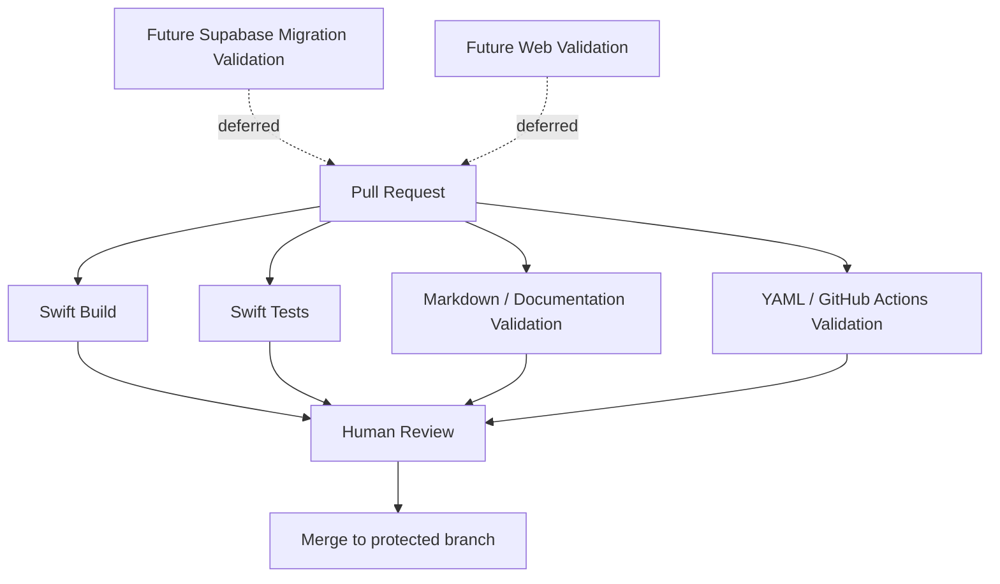

# Implementation Tech Plan: CI/CD Foundation

## Status

Approved

## Owner

TODO

## Product Domain

INFRA

## Related Foundation Documents

- `tech-plans/approved/ARCH-001-app-architecture.md`
- `jira/JIRA_WORKFLOW.md`
- `.github/README.md`
- `Makefile`
- `implementation/proposed/INFRA-001-database-foundation.md`

## Problem Statement

Scout is moving from planning foundation into implementation readiness. Before significant product development begins, the repository needs a professional but intentionally simple CI foundation that every future AI coding agent and human reviewer can trust.

The repository currently contains the iOS app at the root and is being prepared as the future Scout monorepo. CI should validate the current iOS application and documentation now, while leaving clear placeholders for future web and Supabase validation once those areas mature.

## Goals

- Establish required CI checks for pull requests into protected branches.
- Validate the current iOS app through build and test workflows.
- Add lightweight documentation and GitHub Actions validation.
- Define pull request, merge, branch protection, and owner configuration expectations.
- Keep the first implementation simple, reviewable, and aligned with the current repo state.
- Prepare clear future expansion paths for web, Supabase, backend, and release automation.

## Non-goals

- Reorganizing the repository.
- Moving the iOS app into `apps/ios`.
- Migrating the web app into this repository.
- Creating Supabase migrations, tables, storage buckets, Edge Functions, or generated types.
- Building production deployment automation.
- Creating App Store/TestFlight release automation.
- Requiring new paid services beyond GitHub Actions.
- Replacing the existing Makefile unless a later approved plan requires it.

## Current Repository State

- The iOS app currently lives at the repository root.
- `apps/ios/` remains a future placeholder only.
- `apps/web/` remains a future placeholder only.
- `backend/supabase/` is planning/documentation only.
- A root `Makefile` defines `make build`, `make test`, `make build-release`, `make run`, `make doctor`, and `make clean`.
- `.github/workflows/ios-tests.yml` currently runs on pull requests and pushes to `develop`.
- The existing iOS workflow uses:
  - `macos-15`
  - latest stable Xcode
  - Bundler
  - `bundle exec fastlane ios tests`
- The existing `ios-tests.yml` workflow must be renamed, refined, or split carefully during implementation. Do not add duplicate macOS build/test workflows that run the same expensive iOS work twice on every pull request.
- There is not yet a documented CI status policy, branch protection policy, PR template, CODEOWNERS, Dependabot configuration, or separate documentation validation workflow.

## Desired CI Architecture

CI should start as a small set of GitHub Actions workflows with clear ownership and required checks.

Principles:

- Prefer simple workflows over clever shared automation until duplication becomes painful.
- Prefer repository-local commands such as `make build` and `make test` where possible.
- Keep status checks stable so branch protection does not churn.
- Avoid workflows that require secrets for ordinary pull request validation.
- Swift Build and Swift Tests may be separate jobs in one workflow instead of separate workflow files. The important requirement is stable, separately visible status checks without duplicating expensive macOS runner work.
- Keep future web/backend checks as placeholders until implementation plans approve them.

## Required GitHub Actions Workflows

### Implement Now

#### Swift Build

Purpose:

- Prove the iOS app compiles on pull requests.

Expected behavior:

- Run on pull requests to `develop` and pushes to `develop`.
- Use macOS runner and stable Xcode.
- Prefer `make build` or an equivalent existing repository command.
- Coordinate with the existing `ios-tests.yml` workflow so build validation is either added as a separate job in the same workflow or introduced through a careful rename/split.
- Upload build logs only if useful and low-noise.

Required status check:

- `Swift Build`

#### Swift Tests

Purpose:

- Prove the iOS test suite passes on pull requests.

Expected behavior:

- Run on pull requests to `develop` and pushes to `develop`.
- Reuse the current Fastlane path or migrate to `make test` if approved during implementation.
- Keep simulator destination stable.
- Coordinate with the existing `ios-tests.yml` workflow so the current test path is preserved without running duplicate test jobs.

Required status check:

- `Swift Tests`

#### Markdown / Documentation Validation

Purpose:

- Catch broken Markdown structure and low-level docs errors before merge.

Expected behavior:

- Validate Markdown files in `docs/`, `tech-plans/`, `implementation/`, `jira/`, `roadmap/`, root README files, and agent docs.
- Start with lightweight validation such as markdownlint or another approved formatter/checker.
- Avoid turning style opinions into broad blockers until rules are tuned.

Required status check:

- `Docs Validation`

#### YAML / GitHub Actions Validation

Purpose:

- Catch malformed workflow/configuration YAML before merge.

Expected behavior:

- Validate `.github/workflows/*.yml` and other YAML files if present.
- Prefer lightweight syntax validation first.
- Actionlint may be adopted if the implementation story confirms it is practical for this repo.

Required status check:

- `GitHub Actions Validation`

### Adopt Only If Approved During Implementation

#### SwiftLint

Purpose:

- Enforce Swift style and catch common issues.

Current status:

- Not approved by this plan unless implementation confirms SwiftLint is already adopted or adoption is explicitly approved.

Allowed v1 paths:

- If SwiftLint already exists in the repo/toolchain, add a `SwiftLint` workflow.
- If SwiftLint is not already adopted, create a separate approval story before making it required.

Required status check:

- Deferred unless adopted.

### Deferred Placeholders

#### Future Supabase Migration Validation

Deferred until:

- `INFRA-001` is approved.
- A Supabase migration directory exists through an approved implementation plan.
- Local migration validation commands are approved.

Future check examples:

- Migration formatting.
- Local migration apply/reset.
- RLS validation.
- Generated type drift.

#### Future Web Validation

Deferred until:

- The web app is migrated into the monorepo or a web implementation plan is approved.

Future check examples:

- Install dependencies.
- Typecheck.
- Unit tests.
- Lint.
- Build.

## Branch Strategy

Current working assumption:

- `develop` is the active integration branch for Scout development.
- Feature branches should be created from `develop`.
- Pull requests should target `develop` unless a release/hotfix process says otherwise.

Future branch model:

- `main`: stable production/release branch when production releases are active.
- `develop`: day-to-day integration branch.
- `codex/*`, `docs/*`, `feature/*`, or similar: short-lived feature branches.

Open decision:

- Whether `main` already exists as the protected release branch or whether `develop` should be the first protected branch.

## Branch Protection Requirements

Owner configuration is required in GitHub settings. Branch protection work is a `👤 Owner Action`.

Minimum branch protection for `develop`:

- Require pull request before merge.
- Require at least one approving review.
- Require status checks before merge.
- Require branches to be up to date before merge if the team prefers stricter sequencing.
- Restrict force pushes.
- Restrict branch deletion.
- Dismiss stale approvals when new commits are pushed, if desired.
- Require conversation resolution before merge.
- Enable auto-delete merged branches at repository level.

Future branch protection for `main`:

- Require all checks required on `develop`.
- Require stricter review and release/tag process once production releases begin.

## Required Status Checks

Initial required checks:

- `Swift Build`
- `Swift Tests`
- `Docs Validation`
- `GitHub Actions Validation`

Deferred required checks:

- `SwiftLint`, only if adopted.
- `Supabase Migration Validation`, only after migration workflow approval.
- `Web Validation`, only after web migration or approved web implementation plan.

Configuring required checks in GitHub branch protection is a `👤 Owner Action`; creating the checks themselves through GitHub Actions workflow files is `🤖 AI Implementation`.

## Merge Strategy

Recommended repository settings:

- Allow squash merge as the default merge strategy.
- Disable merge commits if the team wants linear history.
- Rebase merge may remain optional if preferred by maintainers.
- Require PR titles and descriptions to be clear enough for release notes and history.

Commit strategy:

- AI agents should keep commits focused and reviewable.
- Documentation-only changes should not be mixed with production code unless explicitly related.

## Pull Request Requirements

Every implementation PR should include:

- Jira ticket key.
- Related approved implementation tech plan.
- Affected repository area: iOS, Web, Supabase, Docs, or CI/CD.
- Summary of changes.
- Scope and out of scope.
- Validation performed.
- Screenshots for UI changes.
- Migration/RLS/generated type notes for database changes.
- Risk and rollback notes where relevant.

Initial repo assets:

- Pull request template.
- Issue templates for implementation story, bug, and documentation/planning work if useful.
- CODEOWNERS for review routing.

## Release / Tag Strategy

High-level only for this phase:

- Do not automate releases in v1 CI foundation.
- Use tags only when a release or milestone process is approved.
- Future release tags should use a consistent format such as `ios-vX.Y.Z` or `vX.Y.Z`, pending release strategy approval.
- TestFlight/App Store automation requires a separate approved implementation plan.

## Secrets Management

Initial CI should avoid secrets where possible.

Rules:

- Do not commit secrets.
- Do not expose Supabase service role keys to ordinary PR workflows.
- Prefer checks that run without secrets for pull requests.
- Repository owner must configure any required GitHub secrets manually.
- Secrets needed for future Supabase, signing, web deployment, or release automation require approved implementation plans.

Expected future secret categories:

- Supabase project refs and anon keys.
- Supabase service role keys, if ever needed in restricted workflows.
- Apple signing credentials.
- Web deployment tokens.
- Notification service credentials.

Secrets configuration is a `👤 Owner Action`. AI agents may document required secret names and usage, but must not create, expose, or request secret values in repository files.

## Future Expansion

### Web

When the web app migrates into this repository, add web checks through a dedicated implementation plan.

Expected future checks:

- Dependency install.
- Typecheck.
- Lint.
- Unit tests.
- Build.

### Backend / Supabase

When Supabase migrations become repo-owned, add backend validation through `INFRA-001` follow-up work.

Expected future checks:

- Migration naming validation.
- Migration apply/reset.
- RLS policy validation.
- Generated type drift checks.
- Edge Function tests if functions exist.

### Release Automation

Future release automation may include:

- TestFlight distribution.
- App Store upload.
- Release notes generation.
- Tagged builds.
- Environment promotion.

Release automation requires separate approval.

## Risks

- macOS GitHub Actions minutes can be slower and more expensive than Linux checks.
- Simulator availability can make iOS tests flaky if destinations are not stable.
- Overly strict docs linting can block useful documentation work.
- Requiring too many checks too early can slow product progress.
- Branch protection can block emergency fixes if configured without an owner override process.
- Introducing SwiftLint without team approval can create noisy churn.
- Future Supabase or Apple signing secrets can create security risk if added too early.

## Rollout Plan

1. Approve or revise this CI/CD foundation plan.
2. Create Jira epic and stories.
3. Add PR template, CODEOWNERS, and local CI documentation.
4. Refine the existing `ios-tests.yml` workflow into clear Swift Build and Swift Tests status checks, either as separate jobs in one workflow or through a careful rename/split that avoids duplicate macOS runs.
5. Add docs validation.
6. Add YAML/GitHub Actions validation.
7. Add CI badges to README after checks are stable.
8. Repository owner configures branch protection and repository settings.
9. Verify a sample PR exercises all required checks.
10. Defer Supabase, web, release, and deployment automation until approved future plans.

## Definition of Done

- `INFRA-003` is approved or revised.
- Required v1 workflows exist and run on pull requests to the active integration branch.
- Required status checks are documented.
- Branch protection expectations are documented and owner configuration tasks are tracked.
- PR template exists and captures Jira, tech plan, repo area, and validation.
- CODEOWNERS exists or an explicit decision is documented to defer it.
- Dependabot is configured or explicitly deferred.
- README includes CI status badges after workflow names are stable.
- Local CI validation documentation exists.
- Future Supabase and web validation are documented as placeholders only.
- No production app code, schema, migrations, storage buckets, Edge Functions, generated types, or release automation are introduced without separate approval.

## Suggested Jira Epic and Stories

Epic:

- `INFRA: CI/CD Foundation`

Scout story point scale:

- `0.25` = approximately 2 hours from implementation through review and merge.
- `0.5` = approximately 4 hours.
- `1` = approximately 1 focused day.
- `2` = approximately 2 days.
- `3` = approximately 3 days.
- `5` = approximately 1 week and should probably be split.

Owner/action labels:

- `🤖 AI Implementation`: can be completed by an AI coding agent in the repository.
- `👤 Owner Action`: requires manual repository owner configuration outside the repository.
- `🤝 Shared`: requires both repository changes and owner/product review.

Stories:

| Story | Label | Points | Repository Area |
| --- | --- | ---: | --- |
| `CI: Approve CI/CD foundation plan` | 🤝 Shared | 0.5 | Docs / CI/CD |
| `CI: Create Swift Build GitHub Action` | 🤖 AI Implementation | 0.75 | CI/CD / iOS |
| `CI: Create Swift Test GitHub Action` | 🤖 AI Implementation | 0.75 | CI/CD / iOS |
| `CI: Decide SwiftLint adoption for v1 CI` | 🤝 Shared | 0.5 | CI/CD / iOS |
| `CI: Add Markdown documentation validation` | 🤖 AI Implementation | 0.5 | CI/CD / Docs |
| `CI: Add YAML and GitHub Actions validation` | 🤖 AI Implementation | 0.5 | CI/CD |
| `CI: Add pull request template` | 🤖 AI Implementation | 0.25 | CI/CD / Docs |
| `CI: Add issue templates` | 🤖 AI Implementation | 0.5 | CI/CD / Docs |
| `CI: Configure CODEOWNERS` | 🤖 AI Implementation | 0.5 | CI/CD / Docs |
| `CI: Configure Dependabot` | 🤖 AI Implementation | 0.5 | CI/CD |
| `CI: Configure GitHub Actions caching` | 🤖 AI Implementation | 0.75 | CI/CD |
| `CI: Add CI status badges to README` | 🤖 AI Implementation | 0.25 | Docs / CI/CD |
| `CI: Document local CI validation workflow` | 🤖 AI Implementation | 0.5 | Docs / CI/CD |
| `CI: Configure branch protection for develop` | 👤 Owner Action | 0.25 | CI/CD |
| `CI: Require pull request reviews and status checks` | 👤 Owner Action | 0.25 | CI/CD |
| `CI: Configure repository merge and branch cleanup settings` | 👤 Owner Action | 0.25 | CI/CD |
| `CI: Verify GitHub Actions permissions` | 👤 Owner Action | 0.25 | CI/CD |
| `CI: Configure repository secrets and Supabase connection placeholders` | 👤 Owner Action | 0.5 | CI/CD / Supabase |
| `CI: Document future Supabase and web validation placeholders` | 🤖 AI Implementation | 0.25 | Docs / CI/CD |
| `CI: Verify CI foundation on a sample pull request` | 🤝 Shared | 0.5 | CI/CD |
