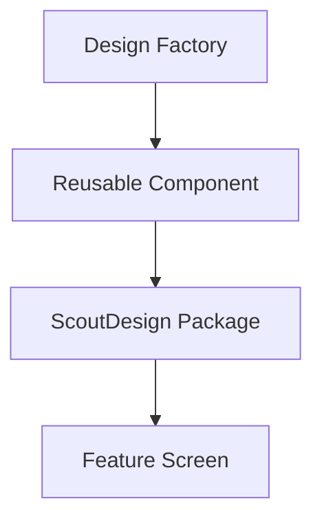

# Implementation Tech Plan: ScoutDesign Adoption

## Status

Proposed

## Owner

TODO

## Product Domain

DESIGN

## Jira Project

CORE

## Related Foundation Documents

- `tech-plans/approved/DESIGN-001-design-system.md`
- `docs/design/DESIGN_SYSTEM.md`
- `tech-plans/approved/ARCH-001-app-architecture.md`
- `implementation/approved/INFRA-003-ci-cd-foundation.md`

## Problem Statement

Scout has an approved design philosophy and an existing `ScoutDesign` Swift package, but the application is still only partially centralized around that package. Several screens already import `ScoutDesign` and use shared colors, typography, spacing, cards, chips, and state components. At the same time, feature screens still define one-off pills, cards, icon buttons, navigation chrome, loading states, empty states, typography choices, and custom glass surfaces.

Without a deliberate adoption plan, future AI agents may continue creating feature-specific UI that looks close enough in isolation but slowly fragments the product. This plan defines how Scout should progressively move toward a single reusable design system without blocking feature delivery or rewriting the entire app at once.

This plan builds on `DESIGN-001`. It does not redefine Scout's design philosophy, experience principles, visual direction, or design-system hierarchy.

## Goals

- Make `ScoutDesign` the default source for reusable iOS UI primitives.
- Establish a clear adoption path for current screens without a broad visual redesign.
- Identify current reusable components, duplicated components, and design debt.
- Define ownership rules for design tokens and components.
- Define when new reusable components should be created versus feature-local UI.
- Introduce the Design Factory as the internal visual inventory and component development surface.
- Generate small, reviewable Jira stories for design-system adoption planning and tooling.

## Non-goals

- Redesigning the app.
- Replacing all feature UI in one migration.
- Implementing Design Factory in this plan.
- Moving iOS project files or package paths.
- Changing Xcode build settings.
- Changing color, typography, spacing, or motion tokens without approval.
- Creating production feature behavior.
- Migrating web design implementation.

## Current Design Architecture Assessment

Current observed structure:

- `ScoutDesign/` is a local Swift package with tokens, reusable components, previews, tests, and resources.
- `Scout/` is the current iOS app at the repository root.
- Many app screens already import `ScoutDesign`.
- `Scout/Design/Components/ScoutBottomNavigationBar.swift` remains app-local while depending on `ScoutDesign`.
- Feature areas such as `Feed`, `Swipe`, `Profile`, `AuthGate`, and `Shared` contain reusable-looking UI that has not yet been evaluated for package ownership.

Current direction:

- `ScoutDesign` should become the default home for reusable primitives and cross-feature components.
- Feature folders may continue owning feature-specific composition and domain-specific screens.
- App-local design code may remain temporarily when it depends on app-only domain types, routing, or navigation state.

## Current ScoutDesign Package Assessment

The package currently includes:

- Foundation tokens:
  - `ScoutColors`
  - `ScoutLayout`
  - `ScoutTheme`
  - Scout typography extensions
- Reusable components:
  - `GlassCard`
  - `GlassChip`
  - `ScoutButton`
  - `ScoutIconButton`
  - `ScoutAvatar`
  - `ScoutStatPill`
  - `ScoutGradientSurface`
  - `ScoutActionDock`
  - `ScoutFooterBar`
  - `ScoutFormPageShell`
  - `ScoutGlassSelectableSurface`
  - `ScoutHeroLayout`
  - `ScoutPageHeader`
  - `ScoutSection`
  - `ScoutSegmentedToggle`
  - `ScoutSelectionRow`
  - `ScoutSignalCard`
  - `ScoutStatTile`
  - `ScoutStateCard`
- Motion helpers:
  - `ScoutMotion`
  - `scoutInteractiveScale`
  - `scoutPulseHighlight`
- Preview galleries:
  - Design foundations
  - Glass components
  - Layouts
  - State and motion

Assessment:

- The package already has the correct center of gravity for reusable design work.
- Tokens and primitives are present but not yet enforced as the only source of truth.
- Preview galleries exist, but they are not yet an in-app debug tool.
- Some useful package components may need API refinement before broad adoption.
- The package should not absorb domain-specific feature logic.

## Existing Reusable Components

Reusable components already suitable for default use:

- Colors: `Color.scout...` semantic tokens.
- Typography: `Font.scout...` semantic roles.
- Spacing/radius/stroke: `ScoutLayout`.
- Cards: `GlassCard`, `ScoutCard`, `ScoutGlassPanel`.
- Chips/pills: `GlassChip`, `ScoutBadge`, `ScoutStatPill`.
- Buttons: `ScoutButton`, `ScoutIconButton`, button styles.
- Segmented controls: `ScoutSegmentedToggle`.
- State display: `ScoutStateCard`.
- Sections and headers: `ScoutSection`, `ScoutPageHeader`.
- Forms/layout: `ScoutFormPageShell`, `ScoutFooterBar`, `ScoutHeroLayout`.
- Motion: `ScoutMotion` and Scout view modifiers.

## Existing Duplicated Components

Candidate duplication areas observed in current app files:

- Feed filter chips and post metadata pills duplicate chip/pill styling.
- Feed post shells and stat cards duplicate reusable card and tile patterns.
- Swipe tags, metric tiles, availability cells, compact headers, and matchup cards duplicate chip/card/stat surfaces.
- Profile builder rows, photo placeholders, and form fields duplicate selection row, state, and card patterns.
- Match modal buttons and icon treatments duplicate reusable button/icon-button styling.
- App-local bottom navigation duplicates reusable glass chrome and icon-button behavior, though it may need to remain app-owned until navigation APIs are generalized.
- Loading states use raw `ProgressView` in several places rather than a shared state component.
- Empty states and error states are inconsistently centralized.

These are candidates for audit and progressive migration. They are not approved for immediate rewrite by this plan.

## Existing Design Debt

- Reusable-looking UI exists inside feature folders.
- Some components combine styling, layout, and domain-specific content.
- Several surfaces use hard-coded numeric values where `ScoutLayout` tokens could be used.
- Some typography uses direct `.system(...)` declarations instead of semantic Scout fonts.
- Some icon usage is feature-local and not inventoried.
- Loading, empty, and error states are not consistently expressed through shared components.
- Component states are mostly visible through SwiftUI previews, not a single debug tool inside the app.
- There is no formal review checklist for deciding whether a new component belongs in `ScoutDesign`.

## Evaluated UI Areas

| Area | Current Assessment | Adoption Direction |
| --- | --- | --- |
| Colors | Semantic `Color.scout...` tokens exist and are widely used. Some opacity/custom combinations are feature-local. | Keep tokens in `ScoutDesign`; audit repeated color recipes before promoting new semantic tokens. |
| Typography | Semantic `Font.scout...` roles exist. Some screens still use direct `.system(...)`. | Prefer semantic fonts; direct system fonts require a local reason or future token proposal. |
| Spacing | `ScoutLayout.Spacing` exists and is used often. Some hard-coded padding remains. | Prefer spacing tokens; audit repeated hard-coded values. |
| Buttons | `ScoutButton`, `ScoutIconButton`, and button styles exist. Feature buttons still duplicate styling. | Reuse package buttons before adding feature-specific button styles. |
| Pills | `GlassChip`, `ScoutBadge`, and `ScoutStatPill` exist. Feed and Swipe still define local pill variants. | Consolidate repeated pill variants through package APIs or approved extensions. |
| Chips | Shared chip foundation exists. Local filter chips and tag chips need audit. | Extend `GlassChip` only when multiple features need the same variant. |
| Segmented controls | `ScoutSegmentedToggle` exists. | Use package control for new segmented UI; extend only through package APIs. |
| Cards | `GlassCard`, `ScoutSignalCard`, `ScoutStatTile`, `ScoutStateCard` exist. Feature cards still duplicate glass card recipes. | Move reusable shells/stat patterns into package after audit. |
| Navigation | Bottom navigation is app-local and depends on app state. | Keep app-owned until a reusable navigation chrome API is designed. |
| Lists | List patterns are mostly feature-owned. | Define reusable row/list shells only after repeated needs are proven. |
| Form controls | Form shell and selection row exist. Profile and onboarding still have local input rows. | Prefer `ScoutFormPageShell` and `ScoutSelectionRow`; create form-field primitives only after audit. |
| Empty states | `ScoutStateCard` supports empty state. | Use or extend `ScoutStateCard` before local empty states. |
| Loading states | Raw `ProgressView` appears in multiple screens. | Create/extend shared loading state patterns through `ScoutStateCard` or a dedicated component. |
| Error states | `ScoutStateCard` supports error state. | Use shared error state with recovery action. |
| Animations | `ScoutMotion` exists for press and pulse behavior. Feature motion is partially local. | Motion should be package-owned when repeated; feature-specific gesture motion can remain local. |
| Icons | SF Symbols are used directly across features. | Document common icon choices in Design Factory before introducing icon abstractions. |

## Migration Philosophy

Adoption should be incremental and screen-safe:

- Do not rewrite a screen only to use `ScoutDesign`.
- Prefer touching UI adoption while already modifying the affected feature.
- Promote repeated patterns after at least two real consumers or one clear cross-feature need.
- Keep feature-specific composition in feature folders.
- Keep reusable styling and primitive behavior in `ScoutDesign`.
- Preserve existing visual behavior unless a design proposal approves a change.
- Use screenshots in PRs for visible UI changes.

## Component Ownership

| Component Type | Owner | Notes |
| --- | --- | --- |
| Design tokens | `ScoutDesign` | Colors, typography, spacing, radius, stroke, shadow, motion timing. |
| Primitive UI | `ScoutDesign` | Buttons, chips, cards, state cards, rows, shells, typography samples. |
| Cross-feature components | `ScoutDesign` after approval | Must have clear reuse and stable API. |
| Feature composition | Feature domain | Screens, domain-specific sections, and content layout. |
| App navigation wiring | App layer | May use design primitives but owns app state and routing. |
| Debug showcase | App debug tooling + `ScoutDesign` | Design Factory displays package components and tokens. |

## Design Token Ownership

- `ScoutDesign` owns all reusable color, typography, spacing, radius, stroke, shadow, and motion tokens.
- Feature code must not introduce parallel token scales.
- Feature-local opacity or gradient recipes are allowed temporarily only when not reusable and not repeated.
- New tokens require an approved design proposal or implementation plan update.
- Token names should describe semantic purpose, not one screen.

## View Composition Guidelines

Feature views should:

- Compose reusable `ScoutDesign` components.
- Keep domain data mapping close to the feature.
- Avoid copying card/chip/button styling recipes.
- Keep custom layout local when it is strongly tied to feature content.
- Extract reusable primitives only after the API is understandable and stable.
- Avoid moving domain models or business logic into `ScoutDesign`.

## Rules for Creating New Reusable Components

A new reusable component may be created when:

- At least two screens need the same UI pattern, or one component is foundational enough to justify reuse.
- It can be expressed without feature-domain models.
- Its states can be shown in Design Factory.
- It uses existing Scout tokens.
- It has a small, stable API.
- It does not duplicate an existing package component that could be extended.

Every new reusable component must:

- Live in `ScoutDesign`.
- Appear in Design Factory.
- Include relevant SwiftUI previews where useful.
- Include accessibility behavior or notes.
- Be referenced from the implementing Jira story.

## Rules for Extending Existing Components

Prefer extension when:

- A current component is conceptually correct but missing a variant or state.
- The change improves multiple consumers.
- The API can stay backward-compatible.

Do not extend when:

- The requested behavior is feature-specific.
- The extension would add domain logic to `ScoutDesign`.
- The component would become a catch-all with unclear purpose.

## Rules for When Duplication Is Acceptable

Temporary duplication is acceptable when:

- A pattern appears only once.
- The API for reuse is not yet clear.
- A feature is experimenting behind a small surface area.
- Extracting immediately would create the wrong abstraction.
- The duplicated code is tracked as design debt if it is likely to spread.

Duplication is not acceptable when:

- A feature copies an existing `ScoutDesign` component's visual behavior.
- New design tokens are invented locally.
- Multiple domains already need the same component.
- A one-off style becomes the default pattern for new work.

## Design Factory Vision

Design Factory is an internal developer/debug tool for visually inspecting Scout's reusable design system.

It should:

- Live behind a debug menu.
- Display every reusable component.
- Display every token.
- Display typography.
- Display spacing.
- Display colors.
- Display icons.
- Display cards.
- Display pills.
- Display segmented controls.
- Display animations.
- Allow developers to visually inspect component states.
- Become the primary location for building new reusable components before production usage.

Design Factory should not be a marketing page or production user surface. It is a development workbench for designers, engineers, and AI agents.

Required workflow for future UI work:

Meaning:

1. New reusable UI is first evaluated visually in Design Factory.
2. The reusable component is implemented or extended in `ScoutDesign`.
3. The feature screen composes the package component.
4. Any feature-local exception is documented in the related Jira ticket.

## Migration Strategy

Recommended sequence:

1. Audit current component usage and duplicated patterns.
2. Define Design Factory scope and debug entry constraints.
3. Create Design Factory shell behind a debug menu.
4. Add token galleries for colors, typography, spacing, radii, and motion.
5. Add component galleries for existing `ScoutDesign` components.
6. Migrate low-risk repeated components first, such as pills, state cards, and stat tiles.
7. Evaluate larger app-local components, such as bottom navigation, only after API boundaries are clear.
8. Require future UI stories to document ScoutDesign reuse and Design Factory coverage.

## Risks

- Over-abstracting too early could make feature work slower.
- Moving domain-specific UI into `ScoutDesign` could couple the package to product domains.
- A broad migration could create many merge conflicts.
- Visual regressions are possible if reusable components are adopted without screenshots.
- Debug tooling could accidentally leak into production navigation.
- Token changes could unintentionally redesign existing screens.
- AI agents may create duplicate components if Jira stories do not require a reuse audit.

## Rollout Plan

1. Approve or revise this plan.
2. Create Jira epic and stories.
3. Complete a design-system adoption audit.
4. Define Design Factory debug entry and safety requirements.
5. Build Design Factory shell in a later approved implementation story.
6. Inventory tokens and existing components inside Design Factory.
7. Migrate small, low-risk duplicate components gradually.
8. Add PR checklist expectations for UI component reuse.
9. Revisit larger navigation and screen shell components after the first adoption pass.

## Future AI Rules

- Reuse `ScoutDesign` before creating new UI.
- Never introduce duplicate design tokens.
- Every reusable component should appear in Design Factory.
- Every new UI component should be evaluated for reuse before remaining feature-specific.
- Feature views should compose reusable components rather than implementing custom styling.
- Do not change typography, spacing, color, radius, shadow, or motion scales without approved design work.
- Do not move feature business logic into `ScoutDesign`.
- Include screenshots for visible UI changes.
- Reference `DESIGN-001` and `DESIGN-002` in every design-system adoption Jira story.

## Definition of Done

- This plan is approved.
- Current design architecture and package state are documented.
- Design Factory concept and workflow are defined.
- Ownership rules for tokens, components, and feature composition are documented.
- Jira epic and stories exist with Scout story points and owner/action labels.
- No production UI migration is performed by this plan.
- Future UI work has clear rules for ScoutDesign reuse and Design Factory coverage.

## Suggested Jira Epic and Stories

Epic:

- `CORE: ScoutDesign Adoption`

Scout story point scale:

- `0.25` = approximately 2 hours.
- `0.5` = approximately 4 hours.
- `1` = approximately 1 focused day.
- `2` = approximately 2 days.
- `3` = approximately 3 days.
- `5` = approximately 1 week and should probably be split.

Stories:

| Story | Label | Points | Repository Area |
| --- | --- | ---: | --- |
| `Design: Approve ScoutDesign adoption plan` | 🤝 Shared | 0.5 | Docs |
| `Design: Audit current ScoutDesign usage` | 🤖 AI Implementation | 1 | iOS / Docs |
| `Design: Inventory duplicated UI patterns` | 🤖 AI Implementation | 1 | iOS / Docs |
| `Design: Define Design Factory debug entry requirements` | 🤝 Shared | 0.5 | iOS / Docs |
| `Design: Create Design Factory shell` | 🤖 AI Implementation | 1 | iOS |
| `Design: Add token galleries to Design Factory` | 🤖 AI Implementation | 1 | iOS |
| `Design: Add existing component galleries to Design Factory` | 🤖 AI Implementation | 1 | iOS |
| `Design: Document component contribution rules` | 🤖 AI Implementation | 0.5 | Docs |
| `Design: Add UI PR checklist for ScoutDesign reuse` | 🤖 AI Implementation | 0.5 | Docs / CI/CD |
| `Design: Decide bottom navigation ownership` | 🤝 Shared | 0.5 | iOS / Docs |
| `Design: Confirm debug menu access policy` | 👤 Owner Action | 0.25 | iOS |
| `Design: Verify Design Factory is not production-visible` | 🤝 Shared | 0.5 | iOS |

