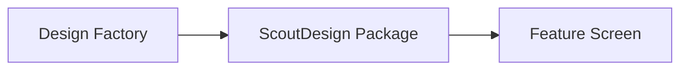
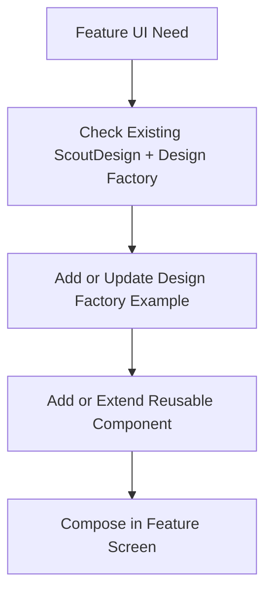

# Implementation Tech Plan: Design Factory

## Status

Proposed

## Owner

TODO

## Product Domain

DESIGN

## Jira Project

CORE

## Related Foundation Documents

- `tech-plans/approved/DESIGN-001-design-system.md`
- `implementation/proposed/DESIGN-002-design-system-adoption.md`
- `docs/design/DESIGN_SYSTEM.md`
- `tech-plans/approved/ARCH-001-app-architecture.md`

## Related Jira

- Epic: `CORE-7` - CORE: ScoutDesign Adoption
- Existing Design Factory stories:
  - `CORE-11` - Design: Define Design Factory debug entry requirements
  - `CORE-12` - Design: Create Design Factory shell
  - `CORE-13` - Design: Add token galleries to Design Factory
  - `CORE-14` - Design: Add existing component galleries to Design Factory
  - `CORE-18` - Design: Confirm debug menu access policy
  - `CORE-19` - Design: Verify Design Factory is not production-visible

## Source of Truth

This plan builds on `DESIGN-001` and `DESIGN-002`. It does not redefine Scout's design philosophy, visual language, component ownership rules, or ScoutDesign adoption strategy.

`DESIGN-002` introduced Design Factory as a required internal developer/debug surface. `DESIGN-003` narrows that concept into an implementation-ready vertical slice.

## Problem Statement

Scout has a growing `ScoutDesign` Swift package, but reusable components currently live mostly in source files and SwiftUI previews. That makes it harder for designers, engineers, and AI agents to inspect available components before creating new UI. Without a single in-app visual inventory, future work may duplicate tokens, rebuild existing components, or miss component states that already exist.

Design Factory should become Scout's internal design-system workbench: a debug-only surface where existing tokens, typography, spacing, icons, components, and motion states can be inspected before they are used or extended in production screens.

## Goals

- Create an implementation-ready plan for the first Design Factory slice.
- Keep Design Factory internal/debug-only and unavailable to production users.
- Reuse existing `ScoutDesign` tokens and components without changing their visual values.
- Provide a single gallery surface for foundations, reusable components, and interaction states.
- Establish the workflow for future reusable UI work: Design Factory -> ScoutDesign -> Feature Screen.
- Give AI implementation agents precise boundaries, sequencing, and validation expectations.

## Non-goals

- Redesigning Scout.
- Changing color, typography, spacing, radius, shadow, or motion tokens.
- Migrating production feature screens to new components.
- Creating new reusable production components unless a separate approved story requires it.
- Moving iOS project files, package paths, or build settings.
- Introducing web design-system implementation.
- Adding backend, Supabase, schema, auth, or storage work.

## Current Repository State

Observed current structure:

- The iOS app currently lives at the repository root under `Scout/`.
- `ScoutDesign/` is a local Swift package with tokens, primitives, components, previews, and tests.
- `Scout/App/RootView.swift` owns root session/onboarding/home routing.
- `Scout/App/ScoutHomeScreen.swift` owns the current authenticated home shell.
- `Scout/Design/Components/ScoutBottomNavigationBar.swift` remains app-local and depends on app navigation state.
- `ScoutDesign/Sources/ScoutDesign/Preview/` already contains preview gallery views, but there is no in-app debug Design Factory.

The implementation should not move files or restructure the project. Any app integration should be narrowly scoped and reversible.

## Desired Design Factory Architecture

Design Factory should be app debug tooling that consumes `ScoutDesign`; it should not become a production feature domain.

Recommended ownership:

| Area | Owner | Notes |
| --- | --- | --- |
| Design tokens | `ScoutDesign` | Existing tokens only for v1. |
| Reusable components | `ScoutDesign` | Display existing components; do not redesign them. |
| Design Factory shell | iOS app debug tooling | Suggested future area: `Scout/DesignFactory/` or `Scout/Debug/DesignFactory/`. |
| Debug access policy | Product/engineering owner | Must be approved before implementation. |
| Demo data | Design Factory | Local mock/demo data only; no production data. |
| Feature screens | Feature domains | Consume ScoutDesign after components are validated. |

Recommended flow:

For new reusable UI after Design Factory exists:

## V1 Scope

The first implementation should create a useful but intentionally small Design Factory:

- Debug-only entry point.
- Shell with category navigation.
- Foundation galleries:
  - Colors.
  - Typography.
  - Spacing.
  - Radius/stroke/elevation where exposed by `ScoutDesign`.
  - Motion tokens and reusable motion modifiers.
- Component galleries:
  - Buttons and icon buttons.
  - Chips, pills, badges, and stat pills.
  - Cards, panels, tiles, sections, and state cards.
  - Segmented controls and selection rows.
  - Form/page shell primitives.
  - Avatars and profile-adjacent primitives.
- State examples:
  - Default.
  - Selected.
  - Disabled where supported.
  - Loading.
  - Empty.
  - Error.
- Visual review requirements:
  - Screenshots in PRs.
  - Notes for any missing state that should become future work.

V1 may use static local demo data only.

## Debug Access Requirements

Design Factory must not be visible to ordinary production users.

Approved direction:

- Design Factory should be available to authenticated users with an `@scoutsports.app` email address.
- Scout Sports employees may eventually access internal tooling in production builds.
- Production access must be explicitly gated by employee identity, not by accidental navigation visibility.
- Non-employee users must not be able to discover or open Design Factory.
- The implementation must avoid relying only on visual hiding; access checks should protect the route itself.

Before implementation, the owner must still approve:

- Where the entry point should live.
- Whether access requires a hidden gesture, developer setting, debug menu, build flag, or another mechanism.
- How reviewers should verify release/production visibility.

Default recommendation for implementation planning:

- Use the smallest app integration necessary.
- Keep local `DEBUG` access convenient for developers, but design the route around an employee access check so the same tool can safely exist in production later.
- Keep the entry route out of normal user navigation.
- Centralize the employee access check instead of duplicating email-domain logic across views.
- Treat the `@scoutsports.app` gate as internal-tool authorization, not product profile visibility.
- Require `CORE-18` before `CORE-12`.

## AI Rules

Future AI agents must:

- Reuse existing `ScoutDesign` components when building Design Factory galleries.
- Never introduce new tokens as part of Design Factory v1.
- Never change existing token values or component styling without an approved design plan.
- Keep Design Factory demo data local, static, and non-user-specific.
- Keep Design Factory behind the approved debug access policy.
- Never expose Design Factory to non-employee accounts in production builds.
- Do not duplicate employee email-domain checks across multiple feature screens; use one approved access helper or service.
- Avoid importing feature domain models into `ScoutDesign`.
- Avoid moving app navigation, Xcode project files, package paths, or build settings unless a separate approved plan requires it.
- Include screenshots for any Design Factory PR with visible UI.
- Reference `DESIGN-001`, `DESIGN-002`, and `DESIGN-003` in Design Factory implementation tickets.

## Dependencies

- `DESIGN-001` approved.
- `DESIGN-002` approved or revised enough to confirm ScoutDesign adoption rules.
- `CORE-18` owner-approved debug menu access policy before any debug route is implemented.
- Authenticated employee identity is available wherever the Design Factory route is checked.
- Existing `ScoutDesign` package remains available to the app.

## Open Product / Owner Decisions

- What is the exact source of truth for employee identity: authenticated email from Supabase auth, an allowlist, a role/claim, or a future admin table?
- Should `@scoutsports.app` email-domain access be sufficient for v1, or should there also be a manually managed allowlist?
- What is the approved entry mechanism once an employee is authorized?
- Should Design Factory live under a hidden app route, a developer settings surface, or a standalone debug shell?
- Are screenshots required for every Design Factory PR or only visible gallery additions?
- Should future component contribution rules live in docs, PR template, or both?

Implementation should not begin on the debug entry until the employee identity source of truth and entry mechanism are resolved.

## Repository Areas Affected

- iOS: Design Factory shell, debug entry, and gallery views.
- ScoutDesign: Read-only consumption in v1; package changes only if required for display and separately reviewed.
- Docs: Contribution rules, PR checklist, and Design Factory usage notes.
- CI/CD: No required change in v1 unless screenshots/checklists are added to PR workflow documentation.

## Validation Strategy

Implementation PRs should validate:

- Existing iOS build path using the repository's approved validation workflow.
- `ScoutDesign` package tests if package files are touched.
- Debug entry visibility in the approved debug context.
- Production/release access is blocked for non-employee users and allowed only for approved employee users according to owner policy.
- Screenshots for each visible gallery added.
- No production user flow changes.

## Rollout Plan

1. Approve or revise `DESIGN-003`.
2. Complete `CORE-18` and confirm debug access policy.
3. Complete `CORE-11` if additional debug entry requirements need documentation.
4. Implement the debug-only Design Factory shell.
5. Add token/foundation galleries.
6. Add existing component galleries.
7. Verify production invisibility.
8. Update future UI contribution docs/checklists to require Design Factory coverage for reusable components.

## Risks

- Internal tooling could accidentally appear in production navigation for non-employee users.
- Design Factory could become stale if new reusable components are not added to it.
- Implementation could expand into a visual redesign if stories are not kept narrow.
- Demo views could accidentally depend on feature domain models.
- Package APIs may be stretched for gallery needs instead of real component reuse.
- Creating a separate Design Factory epic could duplicate existing `CORE-7` stories.

Mitigation:

- Reuse existing `CORE-7` stories unless the owner explicitly wants a separate epic.
- Keep v1 gallery data static and local.
- Require owner-approved employee access policy before implementation.
- Keep token and component changes out of scope unless separately approved.

## Jira Backlog Strategy

Do not create duplicate Design Factory tickets while `CORE-7` already contains the Design Factory implementation slice. Use this plan to refine and sequence the existing stories:

| Story | Label | Points | Repository Area | Notes |
| --- | --- | ---: | --- | --- |
| `CORE-18` Design: Confirm Design Factory employee access policy | 👤 Owner Action | 0.25 | iOS | Must happen before shell implementation. |
| `CORE-11` Design: Define Design Factory debug entry requirements | 🤝 Shared | 0.5 | iOS / Docs | Documents the owner decision and entry constraints. |
| `CORE-12` Design: Create Design Factory shell | 🤖 AI Implementation | 1 | iOS | Build the debug-only shell and category navigation. |
| `CORE-13` Design: Add token galleries to Design Factory | 🤖 AI Implementation | 1 | iOS | Existing colors, typography, spacing, radius/stroke, and motion only. |
| `CORE-14` Design: Add existing component galleries to Design Factory | 🤖 AI Implementation | 1 | iOS | Existing components only; no broad component API changes. |
| `CORE-19` Design: Verify Design Factory is not production-visible | 🤝 Shared | 0.5 | iOS | Required before considering Design Factory v1 complete. |

Recommended follow-up Jira refinements after this plan is approved:

- Update `CORE-12`, `CORE-13`, `CORE-14`, and `CORE-19` to reference `DESIGN-003`.
- Add a story for icon and symbol gallery only if it is not covered cleanly by `CORE-13` or `CORE-14`.
- Add a story for animation/interaction-state gallery only if it is not covered cleanly by `CORE-13` or `CORE-14`.
- Add a docs story for "How to add a component to Design Factory" if `CORE-15` does not cover it.

## Recommended Implementation Order

1. `CORE-18`
2. `CORE-11`
3. `CORE-12`
4. `CORE-13` and `CORE-14` in parallel after `CORE-12`
5. `CORE-19`

Parallelizable work:

- Token galleries and component galleries can proceed in parallel once the shell exists.
- Documentation/checklist work can proceed in parallel with implementation after the debug access policy is known.

Critical path:

`CORE-18` -> `CORE-11` -> `CORE-12` -> gallery stories -> `CORE-19`

## Definition of Done

- `DESIGN-003` is approved.
- Owner-approved debug access policy is documented.
- Design Factory shell exists behind approved debug-only access.
- Foundation and existing component galleries are visible with static demo data.
- Design Factory is verified as inaccessible to non-employee production users.
- Future reusable UI work has a documented route through Design Factory.
- No production feature behavior, schema, auth, storage, package paths, or build settings are changed by this plan.
