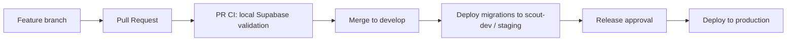
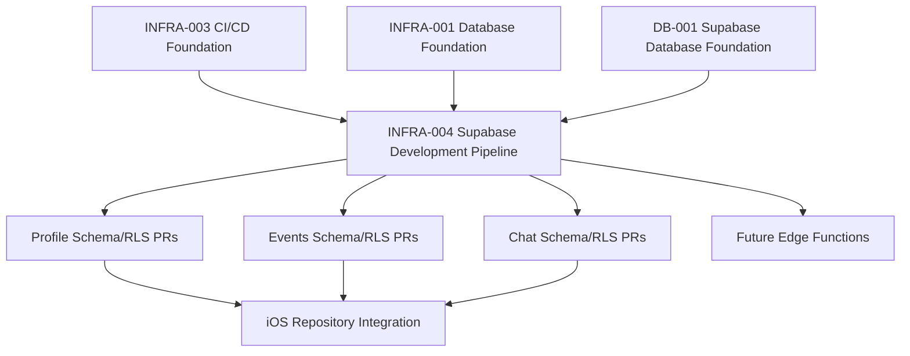

# Implementation Tech Plan: INFRA-004 Supabase Development Pipeline

## Status

Proposed

## Product Domain

INFRA / Supabase

## Jira Project

INFRA

## Work Type

Implementation-readiness plan. This document does not implement schema, migrations, GitHub/Supabase integration, production deployment, Edge Functions, or secrets.

## Source of Truth

This plan becomes the proposed canonical implementation plan for how Scout backend changes are developed, tested, reviewed, and deployed once approved.

Authoritative inputs:

- `tech-plans/approved/ARCH-001-app-architecture.md`
- `implementation/proposed/INFRA-001-database-foundation.md`
- `implementation/proposed/DB-001-supabase-database-foundation.md`
- `implementation/approved/INFRA-003-ci-cd-foundation.md`
- `docs/database/DATABASE.md`
- `docs/database/MIGRATIONS.md`
- `docs/database/RLS.md`
- `docs/database/GENERATED_TYPES.md`
- `docs/database/SECRETS_AND_GITHUB.md`

Official Supabase references used for this plan:

- Supabase changelog: `https://supabase.com/changelog.md`
- Local development: `https://supabase.com/docs/guides/local-development`
- Database migrations: `https://supabase.com/docs/guides/deployment/database-migrations`
- Branching: `https://supabase.com/docs/guides/deployment/branching`
- GitHub integration: `https://supabase.com/docs/guides/deployment/branching/github-integration`
- Branch configuration: `https://supabase.com/docs/guides/deployment/branching/configuration`
- Generated types: `https://supabase.com/docs/guides/api/rest/generating-types`
- Database testing: `https://supabase.com/docs/guides/database/testing`
- Row Level Security: `https://supabase.com/docs/guides/database/postgres/row-level-security`
- Edge Function deployment: `https://supabase.com/docs/guides/functions/deploy`

## Existing Work Audit

### Repository Findings

Existing Scout planning already covers pieces of this pipeline:

| Existing Work | Coverage | Recommendation |
| --- | --- | --- |
| `implementation/proposed/INFRA-001-database-foundation.md` | Initial Supabase project strategy, migrations, source of truth, RLS philosophy, generated types, storage, Edge Functions, seed data, secrets. | Keep as foundation. INFRA-004 should become the end-to-end pipeline plan that operationalizes it. |
| `implementation/proposed/DB-001-supabase-database-foundation.md` | Repo-owned migration workflow, local Supabase commands, generated type workflow, seed/environment conventions, migration validation checklist. | Extend, do not replace. DB-001 should remain the first implementation slice for local structure and commands. |
| `implementation/approved/INFRA-003-ci-cd-foundation.md` | Current CI foundation and future Supabase validation placeholders. | Keep. INFRA-004 defines the future Supabase CI/CD jobs that INFRA-003 intentionally deferred. |
| `docs/database/*.md` | Durable database planning references for migrations, RLS, generated types, secrets, storage, and Edge Functions. | Update during implementation stories only where commands and ownership become concrete. |
| `backend/supabase/` README files | Placeholder directories for migrations, seed data, generated types, config, and future functions. | Keep. No migrations or active config are created by this plan. |
| Domain schema plans such as `PROFILE-003`, `PROFILE-006`, `EVENT-002`, `CHAT-001` | Domain-specific schema/RLS requirements. | These must depend on INFRA-004/DB-001 pipeline readiness before merging real migrations. |

### Jira Findings

Existing Jira work related to this scope:

| Jira | Summary | Recommendation |
| --- | --- | --- |
| `INFRA-1` | INFRA-001: Supabase Database Foundation | Historical/foundation planning. Keep for traceability. |
| `INFRA-34` | DB-001: Supabase Database Foundation | Reuse as the implementation epic for local structure/workflow primitives. |
| `INFRA-35` | DB: Add Supabase repository structure without product schema | Keep. Prerequisite for INFRA-004 implementation. |
| `INFRA-36` | DB: Add local Supabase migration workflow | Keep. Should align to INFRA-004 once approved. |
| `INFRA-37` | DB: Add generated Supabase type workflow | Keep. Should align to INFRA-004 generated type validation. |
| `INFRA-38` | DB: Add RLS seed and environment conventions | Keep. Should align to INFRA-004 testing matrix. |
| `INFRA-39` | DB: Add migration validation and deployment checklist | Extend or supersede with INFRA-004 stories. Existing story is too small for full pipeline authority. |
| `SOCIAL-87` to `SOCIAL-91` | Profile database schema, RLS, generated types, mapper tests | Keep domain-specific. Must not own pipeline rules. |
| `SOCIAL-117` | Community Games schema and RLS | Keep domain-specific. Must consume pipeline rules. |

Do not create duplicate DB foundation work. INFRA-004 should create one new epic for the remaining pipeline decisions and implementation tasks that DB-001 does not fully cover: CI validation, staging/prod promotion, deployment approvals, pgTAP/RLS testing standards, and future Edge Function deployment.

## Research Summary

Official Supabase guidance relevant to Scout:

- Local development uses the Supabase CLI with a Docker-compatible container runtime, `supabase init`, and `supabase start`.
- Migration files are the source of truth for schema changes. Supabase explicitly warns not to make remote Dashboard schema edits once migrations are in use because this bypasses migration history and causes sync errors.
- Local migrations are created with `supabase migration new`, applied with `supabase migration up`, and validated through `supabase db reset`.
- Seed data lives in `supabase/seed.sql` or configured seed paths and is reapplied by local reset.
- Team workflow expects developers to create migrations locally, test with `supabase db reset`, commit migration files, pull/reset when teammates merge, and coordinate remote pushes.
- Supabase Branching can create separate environments for branches. Preview branches are ephemeral and data-less by default. Persistent branches are long-lived and recommended for staging/QA/development.
- The Supabase GitHub integration can watch branches and pull requests, run migrations, seed branches, deploy declared Edge Functions, and add deployment status to PRs. Supabase recommends making the integration a required GitHub check if used.
- Branch configuration is managed through `config.toml`, including `[remotes]` for persistent branch-specific settings and secrets managed per branch.
- Generated types can be produced with the CLI from a remote project or local database, including `supabase gen types typescript --local` for local type generation. Scout also needs Swift-facing generated type strategy, but generated database types must remain data-layer inputs rather than UI/domain models.
- Supabase database tests can run through `supabase test db`, using pgTAP SQL files under `supabase/tests/database`.
- RLS must be enabled on exposed-schema tables, including `public`. SQL-created tables require explicit RLS enablement and grants. UPDATE needs SELECT policy support, UPDATE policies should include both `USING` and `WITH CHECK`, and views should use `security_invoker = true` on Postgres 15+ when exposed.
- Edge Functions deploy through the CLI with `supabase functions deploy`, and CI can use `supabase/setup-cli`. Function configuration such as JWT verification belongs in `config.toml`.
- Changelog items relevant to Scout planning include 2026 changes around Data API exposure no longer being automatic for new tables, a feature-preview RLS Tester, Postgres 14 support ending, and recent/preview branching and declarative schema work. Scout should avoid adopting preview/declarative schema features as core workflow until explicitly approved.

## Scout Evaluation

### Current State

- The repo has iOS CI, docs validation, YAML validation, PR templates, and placeholder Supabase validation docs.
- `backend/supabase/` exists as a planned home for migrations, seeds, generated types, config, and future functions.
- No real Supabase migrations, seed data, generated type outputs, pgTAP tests, or Edge Functions are active in the repo yet.
- Scout has a current `scout-dev` Supabase project, with staging/prod planned later.
- Domain plans are ready to create schema/RLS work, but the backend pipeline is not yet approved enough for safe schema PRs.
- Current app code already uses Supabase, creating schema drift risk until migrations and generated type validation exist.

### Missing Pieces

- Repo-owned active Supabase CLI configuration and command surface.
- Local `supabase start`, `db reset`, migration validation, seed validation, and pgTAP test workflow.
- Generated type output ownership and freshness validation.
- RLS test harness for owner/non-owner/anon/service-role cases.
- Staging and production environment strategy.
- GitHub Actions workflow for Supabase validation.
- Deployment promotion workflow and manual approval gate.
- Rollback and hotfix procedure for database changes.
- Decision on whether/when to use Supabase GitHub integration and Branching.

### Unnecessary Complexity To Avoid

- Do not adopt preview branches for every PR as V0. Scout is still early, migrations are not yet frequent enough to justify the operational complexity.
- Do not deploy directly to production from feature branches.
- Do not require remote Supabase secrets for ordinary PR validation if local validation is sufficient.
- Do not introduce Edge Function deployment automation before Edge Functions exist.
- Do not use Dashboard edits as an implementation path.
- Do not adopt public-alpha declarative schema management as the canonical workflow yet.

## Recommended Architecture

Use the simplest architecture that scales:

Recommended environments:

| Environment | Timing | Purpose | Notes |
| --- | --- | --- | --- |
| Local | Now | Every agent/developer validates migrations, seeds, pgTAP, RLS locally. | Source of truth for PR validation. |
| `scout-dev` as staging/integration | Now | Shared remote integration database for merged backend work. | Treat as staging until a separate staging project exists. |
| Production | Before beta/public users | Real user data and production auth/storage/functions. | Manual deployment approval required. |
| Supabase preview branches | Later | Ephemeral PR environments for high-volume backend work. | Defer until migration volume/parallelism justifies cost and complexity. |
| Dedicated staging project separate from `scout-dev` | Later | More production-like pre-release verification. | Add before beta if `scout-dev` becomes too noisy for release validation. |

Recommendation: start with **Local + `scout-dev` staging/integration + Production later**. Do not enable GitHub-integrated preview branching in V0. Evaluate Supabase Branching after the first 3-5 schema/RLS PRs or when multiple agents regularly touch migrations in parallel.

## Development Workflow

### Local Supabase Workflow

Approved implementation should add repository commands around:

- `supabase start`
- `supabase stop`
- `supabase db reset`
- `supabase migration new <jira-key>_<purpose>`
- `supabase migration up`
- `supabase test db`
- `supabase gen types ... --local`

Agents must not create migration files manually. Use the CLI migration command once DB-001/INFRA-004 implementation adds the active Supabase CLI structure.

### Migration Ownership

- Every migration belongs to one Jira story and one approved implementation plan.
- Migration headers must include Jira key, plan, purpose, affected domain, RLS impact, seed impact, generated type impact, rollback notes, and deployment risk.
- Domain schema plans own product tables and policies.
- INFRA owns migration workflow, validation commands, generated type checks, deployment workflows, and environment rules.
- Dashboard edits are inspection/debugging only, not a source of truth.

### Seed Data

- Seed data is local/dev/staging only unless a future production data plan explicitly approves otherwise.
- Seed data must be deterministic, resettable, non-secret, and non-production-like.
- Domain seed files should be introduced by the same plan that owns the schema.
- Seeds used for RLS or repository tests must be documented with their test purpose.

### Generated Types

- Generate types from local database after migrations are applied and reset.
- Generated types are data-layer inputs only.
- SwiftUI, ViewModels, and domain models must not import generated database types directly.
- PR validation should fail if schema changes require generated type output and the generated type output is stale.
- Web TypeScript output remains deferred until web migration strategy is approved.

## Git Workflow

Feature branch rules:

- One backend domain migration story per PR where possible.
- Do not bundle unrelated domain schema changes.
- Avoid parallel migrations touching the same tables or enum values.
- Pull latest `develop` and reset local Supabase before editing migrations.
- If migration timestamps conflict, rebase and regenerate the local migration file before review.

Merge strategy:

- PRs target `develop`.
- `develop` deploys to `scout-dev`/staging after Supabase CI passes.
- Production deployment is manual/approved from a release branch, tag, or protected `main` strategy once production exists.
- Only one remote database deployment should run at a time per environment.

## CI Strategy

### Every PR

Run without production secrets where possible:

- Supabase CLI install/setup.
- Local Supabase stack start.
- Migration reset validation.
- Seed validation.
- pgTAP database tests with `supabase test db` when tests exist.
- Generated type freshness validation when generated outputs are committed.
- SQL/RLS linting or advisor checks once CLI support is confirmed.
- Existing iOS/docs/YAML checks as applicable.

PR CI should not deploy to remote Supabase projects.

### Every Merge To `develop`

Run:

- All PR checks.
- Deploy pending migrations to `scout-dev`/staging after approval of required secrets and workflow.
- Regenerate/validate types against staging if needed.
- Run staging smoke checks for migration history and critical RLS tests.

### Nightly

Run:

- Full local reset from scratch.
- All pgTAP/RLS tests.
- Generated type freshness.
- Optional `db pull`/drift inspection against staging after approved credentials exist.
- Future Edge Function tests once functions exist.

### Release / Production

Run:

- Validate staging is green.
- Manual owner approval.
- Backup/restore point confirmation where available.
- Apply migrations to production.
- Verify migration list.
- Run safe production smoke checks only.
- Deploy Edge Functions only when function plans approve them.

## CD Strategy

### Staging Deployment

V0:

- Use `scout-dev` as the staging/integration remote.
- Deploy from `develop` only.
- Use GitHub Actions environment secrets scoped to staging.
- Make migration validation a required check before deployment.

### Production Deployment

Before production exists:

- Do not configure production deployment.
- Do not connect GitHub to Supabase production.
- Do not add production secrets.

When production is created:

- Use a protected GitHub environment with manual approval.
- Deploy only from release branch/tag or protected main strategy.
- Require staging success before production deployment.
- Keep production seed disabled unless explicitly approved.
- Run post-deploy verification and document rollback/forward-fix plan.

### Rollback

Database rollback should be treated as forward-only by default:

- Prefer small reversible migrations, but do not assume destructive down migrations are safe.
- Every migration PR must include rollback notes: safe revert, forward-fix, data repair, or backup restore requirement.
- Production rollback may require a new migration rather than reverting Git.
- Destructive migrations require explicit owner approval and backup/restore plan.

### Edge Functions

Edge Functions are deferred until a domain plan requires server-owned behavior.

When introduced:

- Functions live under the approved Supabase directory.
- Function config belongs in `config.toml`.
- Secrets are environment-scoped and never committed.
- CI runs function tests/linting before deploy.
- Staging deploys before production.
- Production deploy requires manual approval.

## Testing Strategy

| Test Type | Tooling | PR | Develop | Nightly | Release |
| --- | --- | --- | --- | --- | --- |
| Migration applies from scratch | `supabase db reset` | Required | Required | Required | Required against staging before prod |
| Seed loads | `supabase db reset` / seed config | Required when seeds change | Required | Required | Staging only unless approved |
| pgTAP database tests | `supabase test db` | Required when tests exist | Required | Required | Required for staging |
| RLS policy tests | pgTAP and/or client integration tests | Required for RLS changes | Required | Required | Staging smoke |
| Generated type freshness | `supabase gen types ... --local` plus diff check | Required for schema/type changes | Required | Required | Validate against staging if configured |
| Repository integration tests | Swift tests against mocks first, local Supabase only when approved | As story requires | As story requires | Optional | No production data |
| Edge Function tests | Deno/function test workflow | When functions change | Required when functions exist | Required | Staging before prod |
| Advisor/lint checks | Supabase CLI advisors or SQL lint once approved | Required when stable | Required | Required | Required |
| Rollback/forward-fix review | PR checklist | Required for migrations | Required | N/A | Required |

RLS test matrix for each user-data table:

- Anonymous user.
- Authenticated owner.
- Authenticated non-owner.
- Related participant/member where applicable.
- Blocked or hidden relationship where applicable.
- Suspended/deleted account where applicable.
- Service role behavior.

## Dependency Graph

## Risks

| Risk | Mitigation |
| --- | --- |
| Premature preview branches add operational noise. | Defer Supabase Branching until migration volume justifies it. |
| Dashboard edits cause migration drift. | Treat repo migrations as source of truth and make Dashboard edits inspection-only. |
| Production deployment happens before staging validation. | Require staging success and manual production approval. |
| RLS appears correct but leaks data. | Require pgTAP/client RLS tests for every user-data table. |
| Generated types leak into UI/domain models. | Keep generated outputs in data layer and require mapper boundaries. |
| Seeds include sensitive or production-like data. | Limit seeds to deterministic local/dev fixtures. |
| Multiple agents create conflicting migrations. | Keep schema PRs small, one domain per PR, and require rebase/reset before review. |
| Edge Functions become an unreviewed backend layer. | Require domain plan plus INFRA-004 follow-up before functions deploy. |

## Rollout Plan

1. Approve or revise INFRA-004.
2. Align DB-001 implementation stories with INFRA-004.
3. Add active Supabase CLI config/workdir and Makefile targets without product schema.
4. Add local migration reset and seed validation.
5. Add generated type workflow and freshness check.
6. Add pgTAP/RLS test structure.
7. Add PR-only Supabase CI validation.
8. Add staging deployment to `scout-dev`.
9. Run first real domain migration through the pipeline.
10. Add production deployment workflow only after production project exists and owner approves secrets/environment.
11. Re-evaluate Supabase Branching after several schema PRs or when parallel migration conflicts become common.

## Jira Breakdown

Create one Epic:

- `INFRA: Supabase Development Pipeline`

Story points use Scout's `0.25` increment scale.

| Order | Story | Work Type | Points | Repository Area | Dependencies |
| --- | --- | --- | ---: | --- | --- |
| 1 | Supabase Pipeline: Approve INFRA-004 and reconcile DB-001 overlap | 🤝 Shared | 0.5 | Docs, Jira | INFRA-004 |
| 2 | Supabase Pipeline: Add local CLI config and command surface | 🤖 AI Implementation | 1 | Supabase, Docs | Story 1, DB-001 |
| 3 | Supabase Pipeline: Add migration reset and seed validation workflow | 🤖 AI Implementation | 1 | Supabase, CI/CD | Story 2 |
| 4 | Supabase Pipeline: Add generated type workflow and freshness check | 🤖 AI Implementation | 1 | Supabase, iOS, CI/CD | Story 3 |
| 5 | Supabase Pipeline: Add pgTAP and RLS test harness | 🤖 AI Implementation | 1.5 | Supabase, CI/CD | Story 3 |
| 6 | Supabase Pipeline: Add PR Supabase validation workflow | 🤖 AI Implementation | 1 | CI/CD, Supabase | Stories 3-5 |
| 7 | Supabase Pipeline: Configure staging deployment to scout-dev | 🤝 Shared | 1 | CI/CD, Supabase | Story 6, owner secrets |
| 8 | Supabase Pipeline: Define production deployment approval workflow | 🤝 Shared | 0.75 | CI/CD, Supabase, Docs | Story 7, production project |
| 9 | Supabase Pipeline: Document rollback, drift, and hotfix procedures | 🤖 AI Implementation | 0.5 | Docs, Supabase | Stories 6-8 |
| 10 | Supabase Pipeline: Evaluate Supabase Branching after initial schema PRs | 🤝 Shared | 0.5 | Docs, Supabase | First 3-5 schema PRs |

## Definition of Done

- Scout has one approved Supabase development pipeline authority.
- Local development, migrations, seed data, generated types, RLS validation, and Edge Function boundaries are defined.
- PR, develop, nightly, staging, release, and production checks are clearly separated.
- Environment strategy is explicit and avoids premature preview branch complexity.
- Jira stories are small enough for AI agents and owner actions are labeled.
- No schema, migration, production code, secrets, GitHub/Supabase integration, or deployment is created by this plan.
