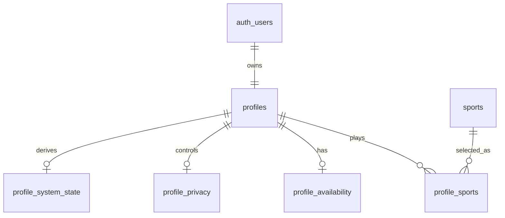

# Implementation Tech Plan: Profile Schema + RLS

## Status

Proposed

## Owner

TODO

## Product Domain

PROFILE

## Source of Truth

This plan translates the approved Player Identity domain model and proposed v1 field set into a proposed Supabase schema and RLS implementation plan.

This document remains `Proposed` until the product owner explicitly approves it. SOCIAL-26 updates this plan for implementation readiness only; it does not authorize SQL migrations, Supabase tables, generated types, storage buckets, Edge Functions, or iOS code changes.

Authoritative inputs:

- `tech-plans/approved/PROFILE-001-player-profile-system.md`
- `implementation/proposed/PROFILE-002-v1-identity-field-set.md`
- `implementation/proposed/INFRA-001-database-foundation.md`
- `docs/database/DATABASE.md`
- `docs/database/SUPABASE.md`
- `docs/database/MIGRATIONS.md`
- `docs/database/RLS.md`

This plan must not be implemented until `PROFILE-002`, `INFRA-001`, and this schema/RLS plan are approved.

## Problem Statement

Scout needs a reviewable, privacy-aware database foundation for v1 Player Identity before Discovery, Events, Chat, Feed, Search, and Notifications can safely consume profile data. The schema must support the minimum v1 identity model without overbuilding future reputation, teams, ratings, or advanced recommendation systems.

The first profile schema must make ownership clear, keep RLS central, and expose profile data through approved contracts rather than encouraging other domains to read or mutate raw profile tables directly.

## Goals

- Define the proposed v1 profile schema shape.
- Define table ownership and relationships.
- Define RLS policy expectations for each proposed table.
- Identify generated type, migration, seed, and validation requirements.
- Prepare the work for small Jira stories and a later migration PR.
- Keep the schema extensible for future Player Identity domains.

## Non-goals

- Writing SQL migrations.
- Creating Supabase tables.
- Creating Supabase storage buckets.
- Changing iOS profile code.
- Implementing profile editing UI.
- Implementing profile photo upload.
- Implementing Discovery, Events, Chat, or Notifications consumers.
- Finalizing future reputation, teams, ratings, clubs, or achievements.

## Proposed Schema Philosophy

The v1 schema should be small, explicit, and contract-friendly.

Principles:

- Profile owns player identity data.
- Auth owns authentication identity; Profile links to authenticated users.
- Consumers should receive profile contracts, not unrestricted profile rows.
- Privacy and account status must be represented before broad consumption.
- Readiness should be derived from approved fields rather than manually guessed by consumers.
- Future domains should extend the model through approved plans rather than creating parallel profile tables.
- Schema should preserve multi-sport extensibility without making v1 overly generic.

## Conceptual Schema

The following table names are proposed for planning. Final SQL requires approval.



## Proposed Tables

The table boundaries below are candidates for approval review. They reflect the SOCIAL-24 field-decision baseline:

- `username` remains optional/deferred for v1 feature requirements, but the schema may reserve a nullable field if approved.
- Profile media path fields may be planned as metadata references, but storage buckets and upload flows require a separate approved media plan.
- Primary sport skill is required for readiness; sport-specific skill modeling is approved for planning.
- Availability remains profile-level and optional for v1; sport-specific availability is deferred.
- `discoverable` should default to false until readiness and product onboarding explicitly enable or confirm discoverability.
- `home_area`, `location_precision`, visibility values, account status values, completion states, and pickleball skill labels remain open schema decisions before migration.

### `profiles`

Purpose: Core identity record linked to an authenticated user.

Candidate fields:

- `id`
- `user_id`
- `display_name`
- `username`
- `profile_photo_path`
- `action_photo_path`
- `bio`
- `created_at`
- `updated_at`

Notes:

- `user_id` should map to the authenticated Supabase user.
- Media fields should reference future storage paths; bucket creation is not approved by this plan.
- `username` remains optional for v1 and should not block readiness. If included in the first migration, uniqueness, normalization, and reserved-word behavior require explicit approval.

### `sports`

Purpose: Supported sports catalog.

Candidate fields:

- `id`
- `slug`
- `display_name`
- `is_active`
- `sort_order`

Notes:

- Pickleball is expected to be the first active sport.
- The catalog can be seeded later only after seed strategy approval.
- Ownership is still open: Profile can own v1 sport choices for planning, but a later catalog/shared infrastructure decision may move ownership.

### `profile_sports`

Purpose: Player sport participation and skill context.

Candidate fields:

- `id`
- `profile_id`
- `sport_id`
- `is_primary`
- `skill_level`
- `created_at`
- `updated_at`

Notes:

- Supports sport-specific skill levels for planning.
- Must prevent multiple primary sports unless a future approved plan allows it.
- Exact skill values and whether they are enum-backed, table-backed, or validation constants remain open before migration.

### `profile_availability`

Purpose: Lightweight v1 availability and play intent.

Candidate fields:

- `profile_id`
- `preferred_days`
- `preferred_times`
- `play_intent`
- `home_area`
- `travel_radius`
- `preferred_play_style`
- `updated_at`

Notes:

- Exact location is out of scope.
- Home area precision requires product approval before implementation.
- V1 planning assumes one optional availability row per profile. Sport-specific availability is deferred.
- `preferred_days`, `preferred_times`, `travel_radius`, and `preferred_play_style` are enrichment fields, not v1 readiness blockers.

### `profile_privacy`

Purpose: Profile visibility and discovery controls.

Candidate fields:

- `profile_id`
- `profile_visibility`
- `discoverable`
- `location_precision`
- `updated_at`

Notes:

- `discoverable` should default false until the user is Discovery Ready and product onboarding explicitly enables or confirms discoverability.
- Final visibility values and user-facing setting labels require approval before migration.
- Privacy rules override Discovery, Events, Chat, Search, and Notification convenience.

### `profile_system_state`

Purpose: Derived system state for readiness and account visibility.

Candidate fields:

- `profile_id`
- `profile_completion_state`
- `account_status`
- `last_active_at`
- `updated_at`

Notes:

- Completion state should be derived from approved readiness rules.
- Account status may be owned partly by Auth/Trust later, so ownership requires review before implementation.
- `last_active_at` should remain system-only in v1 unless approved.
- `last_active_at` should not influence recommendations until a privacy/product decision approves that use.

## Candidate Contracts

The schema should support these profile contracts from `PROFILE-001` without requiring consumers to query every table directly.

| Contract | Intended Consumers | Candidate Data | Privacy Notes |
| --- | --- | --- | --- |
| Swipe Summary | Discovery, Recommendations | Display name, profile photo, primary sport, skill, play intent, coarse home area if approved | Must respect `discoverable`, visibility, blocking, and location precision. |
| Event Summary | Events, Maps, Notifications | Display name, profile photo, relevant sport/skill, play intent, account status eligibility | Must not reveal exact location or private preferences. |
| Chat Summary | Chat, Notifications | Display name, profile photo, minimal context | Must avoid private availability and location data. |
| Public Profile | Feed, Search, future Web | Approved identity and sports context | Must respect visibility and blocked/hidden rules. |
| Full Editable Profile | Profile UI only | Owner-editable fields plus completion state | Owner-only. |

## Ownership Matrix

| Concept | Owning Domain | Consuming Domains | Notes |
| --- | --- | --- | --- |
| Core identity | Profile | Discovery, Events, Chat, Feed, Search, Notifications | Consumers use contracts. |
| Sports selection | Profile | Discovery, Events, Recommendations, Search | Sport catalog may be shared infrastructure later. |
| Skill level | Profile | Discovery, Events, Recommendations | V1 labels require product approval. |
| Availability | Profile | Discovery, Events, Recommendations, Notifications | Global vs sport-specific availability is still open. |
| Privacy controls | Profile | All consumers | Privacy rules are authoritative. |
| Completion/readiness | Profile | Onboarding, Discovery, Events, Chat | Derived from approved rules. |
| Account status | Auth/Profile/Trust, future | All consumers | Ownership may need ADR if Trust becomes separate. |
| Profile media metadata | Profile | Discovery, Events, Chat, Feed | Storage bucket plan is separate. |

## RLS Planning

Final policies require SQL review. These templates define intent only.

| Table | Owner | Owner Behavior | Non-owner Behavior | Read Policy | Insert Policy | Update Policy | Delete/Retention Policy | Service Role Behavior | Blocked/Hidden/Restricted Behavior | Testing Notes |
| --- | --- | --- | --- | --- | --- | --- | --- | --- | --- | --- |
| `profiles` | Profile | Owner can read the full editable identity row and update owner-editable identity fields. | Non-owners should receive only approved profile contracts, not unrestricted profile rows. | Owner full read; non-owner reads only through approved visibility/relationship rules. | Authenticated user can create only their own profile through the approved flow. | Owner can update editable fields; system-only and lifecycle fields are excluded. | Deletion strategy is TBD; likely follows account lifecycle and soft-delete rules. | Allowed for named admin, moderation, migration, or support use cases only. | Blocked, hidden, private, restricted, deleted, or suspended users must be excluded from unrelated discovery and summary reads. | Owner read/update allowed; owner system-field update denied; non-owner summary read allowed only when visible; blocked/private/restricted reads denied. |
| `sports` | Profile/Infrastructure, pending ownership decision | Owners are service/admin maintainers, not end users. | Authenticated clients may read active catalog rows if approved. | Active sports readable by authenticated clients; inactive sports behavior TBD. | Service/admin only. | Service/admin only. | Catalog deletion should be restricted; prefer inactive state over hard delete. | Allowed for catalog management and migrations. | Not user-specific; inactive sports should not appear in selection contracts. | Active catalog read allowed; inactive handling verified; client insert/update/delete denied. |
| `profile_sports` | Profile | Owner can read and manage their own sport participation and skill rows within readiness rules. | Non-owners receive only contract-approved sport/skill context. | Owner full read; non-owner reads only through approved Discovery/Event/Search/Public Profile contracts. | Owner can insert own approved sports; ownership must derive from authenticated profile. | Owner can update own sport/skill choices; primary sport changes must preserve one-primary rules. | Owner can remove sport entries only when readiness and dependent data rules allow. | Allowed for support, moderation, migration, or data repair only. | Hidden sports, blocked users, private profiles, and restricted/deleted accounts must not leak through summaries. | Owner CRUD allowed; duplicate primary denied; unsupported sport denied; non-owner contract read allowed; blocked/hidden/private denied. |
| `profile_availability` | Profile | Owner can read and update full availability and preference fields. | Non-owners should not read raw availability rows. | Owner full read; consumer access limited to approved summaries or recommendation use. | Owner can create only their own availability row. | Owner can update own availability; sport-specific rows are out of scope for v1. | Owner can clear own availability; retention follows profile lifecycle. | Allowed for system maintenance or approved recommendation processing only. | Blocked users, private profiles, and restricted/deleted accounts cannot access availability details. | Owner full access allowed; unrelated non-owner raw read denied; approved summary behavior verified; private/blocked denied. |
| `profile_privacy` | Profile | Owner can read and update their own privacy settings within approved values. | Non-owners should see only the effects of privacy settings, not raw settings. | Owner full read; consumers receive filtered effects through contracts. | Created with approved profile defaults. | Owner can update allowed settings; system constraints must prevent invalid exposure. | Deletion follows profile lifecycle. | Allowed for moderation/support only when needed to enforce safety. | Privacy overrides convenience across blocked, hidden, private, restricted, deleted, and suspended states. | Default `discoverable = false`; opt-in/out behavior; invalid visibility denied; blocked/private summary denied. |
| `profile_system_state` | Profile/Auth/Trust, pending ownership decision | Owner may read safe readiness state but cannot directly edit derived/system fields. | Non-owners receive only eligibility effects through approved contracts. | Owner safe read; system-only fields restricted; consumer reads only through eligibility filters. | System-created with profile/account lifecycle. | System/service controlled; owner updates denied. | Deletion/retention follows account lifecycle and trust/safety requirements. | Required for derived state, moderation, account lifecycle, and migrations. | Restricted, deleted, suspended, hidden, or blocked accounts must be excluded from consumer contracts according to approved rules. | Owner safe read allowed; owner update denied; restricted/deleted excluded; service role behavior verified manually until automated tests exist. |

## Migration Strategy

No migration is created by this plan.

If approved, the first migration should:

1. Create only the approved v1 profile schema.
2. Include migration header comments referencing Jira and this approved plan.
3. Include RLS enablement and approved policy definitions.
4. Include indexes required by v1 access patterns.
5. Avoid unrelated Discovery, Event, Chat, Notification, or storage changes.

Proposed migration name format:

```text
YYYYMMDDHHMMSS_SOCIAL-XXX_create_profile_schema_and_rls.sql
```

Before the first migration is created, approval must be captured for:

- This schema/RLS plan moving from proposed to approved.
- The authorizing Jira implementation story for the migration.
- Final table boundaries and ownership for `profiles`, `sports`, `profile_sports`, `profile_availability`, `profile_privacy`, and `profile_system_state`.
- Final enum, lookup, or validation strategy for visibility, account status, completion state, play intent, preferred play style, weekdays, time windows, travel radius, location precision, and pickleball skill labels.
- RLS policies and validation cases for owner, non-owner, anonymous, blocked, hidden, private, restricted, deleted, suspended, and service-role scenarios.
- Generated type output strategy and whether generated files are committed or deferred.
- Seed data strategy for supported sports and any required validation fixtures.

## Generated Types

The implementation PR should document whether generated Supabase types are included.

Current planning position:

- Generated types are not created or committed by this plan.
- Schema-changing PRs must include a generated type note: `Updated`, `Not changed`, or `Deferred`.
- Checked-in iOS generated types remain deferred until Swift output ownership and path are approved.
- Future web generated types remain deferred until web repo/app strategy is approved.
- Local generation for validation may be allowed by the future migration story, but output should not be committed unless the generated type strategy is approved.

Open generated type decisions:

- Whether the first profile migration commits iOS generated types, defers them, or generates them only for validation.
- Which Supabase command, target, and output path are approved for iOS.
- Whether future web or Edge Function type outputs are included in the same strategy or handled later.

## Seed Data

Seed data is not approved by this plan.

Future seed planning should include:

- Supported sport catalog entries.
- Example fake profile rows.
- Example privacy states.
- Example readiness states.

Seed data must never include real users, real locations, or production secrets.

## Storage Impact

This plan may include media path fields, but it does not approve storage buckets.

Future plan required:

- `PROFILE-004-profile-media-storage.md` or equivalent.

That plan should define bucket names, path conventions, public/private access, signed URLs, image constraints, deletion, and moderation.

## API and Service Impact

The schema should support future repository/service boundaries:

- Profile editable repository.
- Profile contract query layer.
- Profile readiness derivation.
- Profile privacy filtering.

No iOS repository or service code is changed by this plan.

## Open Decisions Requiring Approval

- Are the proposed table boundaries approved?
- Is `sports` a Profile-owned table, shared Infrastructure table, or future catalog domain?
- Is `profile_system_state` Profile-owned, Auth-owned, or shared with future Trust/Safety?
- Should availability be a single row per profile or support multiple sport-specific rows?
- Should `username` be included in the first schema migration?
- Should `profile_photo_path` and `action_photo_path` be included before storage bucket approval?
- Which visibility enum values are approved?
- Which account status values are approved?
- Which completion states are approved?
- Which skill-level values are approved for pickleball v1?
- Should profile contracts be implemented as SQL views, RPCs, Edge Functions, or application-layer projections?

## Suggested Jira Epic and Stories

Do not create these until this plan is approved.

Epic:

- `SOCIAL: Profile Schema + RLS`

Stories:

- `Profile: Finalize v1 profile table boundaries`
- `Profile: Define profile enum values and validation rules`
- `Profile: Write profile schema migration`
- `Profile: Add profile RLS policies`
- `Profile: Add profile RLS validation cases`
- `Profile: Decide generated type strategy for profile schema`
- `Profile: Update database docs with approved profile schema`
- `Profile: Prepare profile contract implementation plan`

## Testing Strategy

Future implementation should validate:

- Migration applies locally.
- Migration can be reset locally.
- RLS positive access cases.
- RLS negative access cases.
- Owner versus non-owner reads.
- Owner editable versus system-only updates.
- Blocked/private/restricted visibility behavior.
- Generated types are updated or intentionally deferred.

## Rollout Plan

1. Approve `INFRA-001`.
2. Approve or revise `PROFILE-002`.
3. Review and approve this schema/RLS plan.
4. Create Jira epic/stories.
5. Create the first migration PR.
6. Validate locally against `scout-dev` workflow.
7. Update database docs after merge.

## Definition of Done

- Proposed schema tables are reviewed.
- RLS policy intent is reviewed.
- Open decisions are approved or explicitly deferred.
- No SQL migration is written by this plan.
- No Supabase folders, generated types, storage buckets, Edge Functions, or production code are created by this plan.
- The first profile migration PR can be created from approved Jira work without redefining Player Identity.
