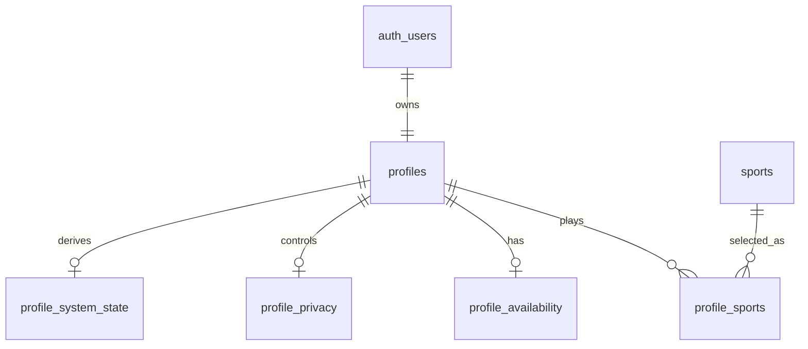

# Implementation Tech Plan: Profile Schema + RLS

## Status

Proposed

## Owner

TODO

## Product Domain

PROFILE

## Source of Truth

This plan translates the approved Player Identity domain model and proposed v1 field set into a proposed Supabase schema and RLS implementation plan.

Authoritative inputs:

- `tech-plans/approved/PROFILE-001-player-profile-system.md`
- `implementation/proposed/PROFILE-002-v1-identity-field-set.md`
- `implementation/proposed/INFRA-001-database-foundation.md`
- `docs/database/DATABASE.md`
- `docs/database/SUPABASE.md`
- `docs/database/MIGRATIONS.md`
- `docs/database/RLS.md`

This plan must not be implemented until `PROFILE-002` and `INFRA-001` are approved.

## Problem Statement

Scout needs a reviewable, privacy-aware database foundation for v1 Player Identity before Discovery, Events, Chat, Feed, Search, and Notifications can safely consume profile data. The schema must support the minimum v1 identity model without overbuilding future reputation, teams, ratings, or advanced recommendation systems.

The first profile schema must make ownership clear, keep RLS central, and expose profile data through approved contracts rather than encouraging other domains to read or mutate raw profile tables directly.

## Goals

- Define the proposed v1 profile schema shape.
- Define table ownership and relationships.
- Define RLS policy expectations for each proposed table.
- Identify generated type, migration, seed, and validation requirements.
- Prepare the work for small Jira stories and a later migration PR.
- Keep the schema extensible for future Player Identity domains.

## Non-goals

- Writing SQL migrations.
- Creating Supabase tables.
- Creating Supabase storage buckets.
- Changing iOS profile code.
- Implementing profile editing UI.
- Implementing profile photo upload.
- Implementing Discovery, Events, Chat, or Notifications consumers.
- Finalizing future reputation, teams, ratings, clubs, or achievements.

## Proposed Schema Philosophy

The v1 schema should be small, explicit, and contract-friendly.

Principles:

- Profile owns player identity data.
- Auth owns authentication identity; Profile links to authenticated users.
- Consumers should receive profile contracts, not unrestricted profile rows.
- Privacy and account status must be represented before broad consumption.
- Readiness should be derived from approved fields rather than manually guessed by consumers.
- Future domains should extend the model through approved plans rather than creating parallel profile tables.
- Schema should preserve multi-sport extensibility without making v1 overly generic.

## Conceptual Schema

The following table names are proposed for planning. Final SQL requires approval.



## Proposed Tables

### `profiles`

Purpose: Core identity record linked to an authenticated user.

Candidate fields:

- `id`
- `user_id`
- `display_name`
- `username`
- `profile_photo_path`
- `action_photo_path`
- `bio`
- `created_at`
- `updated_at`

Notes:

- `user_id` should map to the authenticated Supabase user.
- Media fields should reference future storage paths; bucket creation is not approved by this plan.
- `username` remains conditional on `PROFILE-002` approval.

### `sports`

Purpose: Supported sports catalog.

Candidate fields:

- `id`
- `slug`
- `display_name`
- `is_active`
- `sort_order`

Notes:

- Pickleball is expected to be the first active sport.
- The catalog can be seeded later only after seed strategy approval.

### `profile_sports`

Purpose: Player sport participation and skill context.

Candidate fields:

- `id`
- `profile_id`
- `sport_id`
- `is_primary`
- `skill_level`
- `created_at`
- `updated_at`

Notes:

- Supports sport-specific skill levels if approved in `PROFILE-002`.
- Must prevent multiple primary sports unless a future approved plan allows it.

### `profile_availability`

Purpose: Lightweight v1 availability and play intent.

Candidate fields:

- `profile_id`
- `preferred_days`
- `preferred_times`
- `play_intent`
- `home_area`
- `travel_radius`
- `preferred_play_style`
- `updated_at`

Notes:

- Exact location is out of scope.
- Home area precision requires product approval before implementation.

### `profile_privacy`

Purpose: Profile visibility and discovery controls.

Candidate fields:

- `profile_id`
- `profile_visibility`
- `discoverable`
- `location_precision`
- `updated_at`

Notes:

- Privacy defaults require approval in `PROFILE-002`.
- Privacy rules override Discovery, Events, Chat, Search, and Notification convenience.

### `profile_system_state`

Purpose: Derived system state for readiness and account visibility.

Candidate fields:

- `profile_id`
- `profile_completion_state`
- `account_status`
- `last_active_at`
- `updated_at`

Notes:

- Completion state should be derived from approved readiness rules.
- Account status may be owned partly by Auth/Trust later, so ownership requires review before implementation.
- `last_active_at` should remain system-only in v1 unless approved.

## Candidate Contracts

The schema should support these profile contracts from `PROFILE-001` without requiring consumers to query every table directly.

| Contract | Intended Consumers | Candidate Data | Privacy Notes |
| --- | --- | --- | --- |
| Swipe Summary | Discovery, Recommendations | Display name, profile photo, primary sport, skill, play intent, coarse home area if approved | Must respect `discoverable`, visibility, blocking, and location precision. |
| Event Summary | Events, Maps, Notifications | Display name, profile photo, relevant sport/skill, play intent, account status eligibility | Must not reveal exact location or private preferences. |
| Chat Summary | Chat, Notifications | Display name, profile photo, minimal context | Must avoid private availability and location data. |
| Public Profile | Feed, Search, future Web | Approved identity and sports context | Must respect visibility and blocked/hidden rules. |
| Full Editable Profile | Profile UI only | Owner-editable fields plus completion state | Owner-only. |

## Ownership Matrix

| Concept | Owning Domain | Consuming Domains | Notes |
| --- | --- | --- | --- |
| Core identity | Profile | Discovery, Events, Chat, Feed, Search, Notifications | Consumers use contracts. |
| Sports selection | Profile | Discovery, Events, Recommendations, Search | Sport catalog may be shared infrastructure later. |
| Skill level | Profile | Discovery, Events, Recommendations | V1 labels require product approval. |
| Availability | Profile | Discovery, Events, Recommendations, Notifications | Global vs sport-specific availability is still open. |
| Privacy controls | Profile | All consumers | Privacy rules are authoritative. |
| Completion/readiness | Profile | Onboarding, Discovery, Events, Chat | Derived from approved rules. |
| Account status | Auth/Profile/Trust, future | All consumers | Ownership may need ADR if Trust becomes separate. |
| Profile media metadata | Profile | Discovery, Events, Chat, Feed | Storage bucket plan is separate. |

## RLS Planning

Final policies require SQL review. These templates define intent only.

| Table | Owner | Read Policy | Insert Policy | Update Policy | Delete Policy | Service Role Behavior | Blocked/Hidden Behavior | Testing Notes |
| --- | --- | --- | --- | --- | --- | --- | --- | --- |
| `profiles` | Profile | Owner can read full row; consumers should read approved summaries only; public/profile-visible reads depend on visibility. | Authenticated user can create own profile through approved flow. | Owner can update editable identity fields; system-only fields excluded. | Deletion strategy TBD; likely soft-delete/account lifecycle. | Allowed for admin/system maintenance only. | Blocked/hidden/private users should not be visible to blocked consumers. | Owner read/update; non-owner summary read; blocked read denied. |
| `sports` | Profile/Infrastructure | Active sports may be readable by authenticated clients. | Service/admin only. | Service/admin only. | Service/admin only. | Allowed for catalog management. | Not user-specific. | Active catalog read; inactive handling. |
| `profile_sports` | Profile | Owner can read own; consumers can read contract-approved sport/skill context. | Owner can insert own approved sports. | Owner can update own sports/skills. | Owner can remove own sport entries if readiness rules allow. | Allowed for support/moderation only. | Hidden sports must not appear in consumer summaries if future hidden-sport setting is approved. | Owner CRUD; non-owner contract read; hidden/blocked cases. |
| `profile_availability` | Profile | Owner can read full; consumers receive limited availability only when approved. | Owner can create own availability. | Owner can update own availability. | Owner can clear own availability. | Allowed for system maintenance only. | Blocked users and private profiles cannot access availability details. | Owner full access; consumer limited access; private denied. |
| `profile_privacy` | Profile | Owner can read full privacy settings; consumers should only receive effects, not settings. | Created with profile defaults. | Owner can update own settings. | Deletion follows profile lifecycle. | Allowed for moderation/support only. | Privacy always overrides convenience. | Defaults; opt-in/out; blocked visibility. |
| `profile_system_state` | Profile/Auth/Trust | Owner may read safe readiness state; system-only fields restricted. | System-created. | System/service controlled; owner cannot directly edit. | Deletion follows profile lifecycle. | Required for derived state, moderation, and lifecycle. | Restricted/deleted accounts should be excluded from consumer contracts. | Owner safe read; owner update denied; restricted account excluded. |

## Migration Strategy

No migration is created by this plan.

If approved, the first migration should:

1. Create only the approved v1 profile schema.
2. Include migration header comments referencing Jira and this approved plan.
3. Include RLS enablement and approved policy definitions.
4. Include indexes required by v1 access patterns.
5. Avoid unrelated Discovery, Event, Chat, Notification, or storage changes.

Proposed migration name format:

```text
YYYYMMDDHHMMSS_SOCIAL-XXX_create_profile_schema_and_rls.sql
```

## Generated Types

The implementation PR should document whether generated Supabase types are included.

Open decision:

- Generate types for iOS now, future web later.
- Defer checked-in generated types until monorepo strategy is approved.
- Generate types for review only and do not commit yet.

## Seed Data

Seed data is not approved by this plan.

Future seed planning should include:

- Supported sport catalog entries.
- Example fake profile rows.
- Example privacy states.
- Example readiness states.

Seed data must never include real users, real locations, or production secrets.

## Storage Impact

This plan may include media path fields, but it does not approve storage buckets.

Future plan required:

- `PROFILE-004-profile-media-storage.md` or equivalent.

That plan should define bucket names, path conventions, public/private access, signed URLs, image constraints, deletion, and moderation.

## API and Service Impact

The schema should support future repository/service boundaries:

- Profile editable repository.
- Profile contract query layer.
- Profile readiness derivation.
- Profile privacy filtering.

No iOS repository or service code is changed by this plan.

## Open Decisions Requiring Approval

- Are the proposed table boundaries approved?
- Is `sports` a Profile-owned table, shared Infrastructure table, or future catalog domain?
- Is `profile_system_state` Profile-owned, Auth-owned, or shared with future Trust/Safety?
- Should availability be a single row per profile or support multiple sport-specific rows?
- Should `username` be included in the first schema migration?
- Should `profile_photo_path` and `action_photo_path` be included before storage bucket approval?
- Which visibility enum values are approved?
- Which account status values are approved?
- Which completion states are approved?
- Which skill-level values are approved for pickleball v1?
- Should profile contracts be implemented as SQL views, RPCs, Edge Functions, or application-layer projections?

## Suggested Jira Epic and Stories

Do not create these until this plan is approved.

Epic:

- `SOCIAL: Profile Schema + RLS`

Stories:

- `Profile: Finalize v1 profile table boundaries`
- `Profile: Define profile enum values and validation rules`
- `Profile: Write profile schema migration`
- `Profile: Add profile RLS policies`
- `Profile: Add profile RLS validation cases`
- `Profile: Decide generated type strategy for profile schema`
- `Profile: Update database docs with approved profile schema`
- `Profile: Prepare profile contract implementation plan`

## Testing Strategy

Future implementation should validate:

- Migration applies locally.
- Migration can be reset locally.
- RLS positive access cases.
- RLS negative access cases.
- Owner versus non-owner reads.
- Owner editable versus system-only updates.
- Blocked/private/restricted visibility behavior.
- Generated types are updated or intentionally deferred.

## Rollout Plan

1. Approve `INFRA-001`.
2. Approve or revise `PROFILE-002`.
3. Review and approve this schema/RLS plan.
4. Create Jira epic/stories.
5. Create the first migration PR.
6. Validate locally against `scout-dev` workflow.
7. Update database docs after merge.

## Definition of Done

- Proposed schema tables are reviewed.
- RLS policy intent is reviewed.
- Open decisions are approved or explicitly deferred.
- No SQL migration is written by this plan.
- No Supabase folders, generated types, storage buckets, Edge Functions, or production code are created by this plan.
- The first profile migration PR can be created from approved Jira work without redefining Player Identity.
