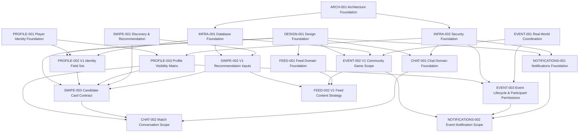

# Roadmap Dependencies

This document visualizes major dependencies between Scout roadmap items across domains.

It is intentionally high-level. Detailed sequencing belongs in implementation tech plans once work is imminent.

## Dependency Graph

## Critical Path

The near-term critical path is:

1. `INFRA-001` and `INFRA-002` define database and security rules.
2. `PROFILE-002` and `PROFILE-003` define the identity fields and visibility rules consumed by other domains.
3. `SWIPE-002` and `SWIPE-003` define the first discovery inputs and candidate card contract.
4. `EVENT-002` and `EVENT-003` define v1 community games and event lifecycle permissions.
5. `NOTIFICATIONS-001` and `NOTIFICATIONS-002` define the notification model needed for event attendance and coordination.
6. `CHAT-001` and `CHAT-002` define post-match coordination.
7. `FEED-001` and `FEED-002` compose Profile, Events, Discovery, and Notifications into the first useful feed experience.

## Work That Can Proceed In Parallel

The following can proceed in parallel after the foundation PRs are merged:

- `INFRA-001` Database Foundation and `INFRA-002` Security Foundation.
- `PROFILE-002` V1 Identity Field Set and `PROFILE-003` Profile Visibility Matrix, once Profile foundation is accepted.
- `FEED-001`, `CHAT-001`, and `NOTIFICATIONS-001` domain foundations, because they define boundaries rather than implementation.
- `EVENT-002` and `SWIPE-002` planning can begin in parallel, but implementation should wait for Profile visibility and Infra guidance.

## Dependency Risks

- Discovery and Events both depend on Profile visibility rules. Delaying `PROFILE-003` blocks safe candidate cards, event participant summaries, chat headers, and notifications.
- Notifications should not be implemented as a feature inside Events or Chat. `NOTIFICATIONS-001` should establish the domain boundary first.
- Feed risks becoming a catch-all surface unless `FEED-001` is completed before feed implementation work expands.
- Database and security foundations should land before schema, RLS, storage, or notification delivery implementation plans.
