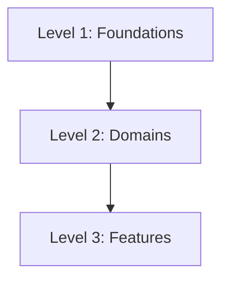

# Scout Planning Levels

Scout technical planning uses a three-tier architecture.

This hierarchy keeps platform rules, business domains, and feature implementation separate so future plans do not redefine concepts owned by a higher level.

## Level 1: Foundations

Foundations define the platform's rules.

Examples:

- Architecture
- Design System
- Player Identity
- Database
- Security

Foundation plans answer:

- What principles govern the system?
- What rules must every domain and feature follow?
- What decisions require ADRs or explicit approval?
- What contracts, privacy expectations, or platform constraints are universal?

Foundation plans should be referenced by all relevant Level 2 and Level 3 plans.

## Level 2: Domains

Domains define business capabilities.

Examples:

- Events
- Swipe
- Feed
- Chat
- Maps
- Recommendations
- Notifications

Domain plans must reference relevant Level 1 foundations and define:

- Philosophy
- Conceptual Model
- Lifecycle
- Ownership
- Contracts
- Consumers
- AI Rules
- Future Extensions

Domain plans are authoritative for their business capability. They should not redefine foundational rules.

## Level 3: Features

Features define specific implementations.

Examples:

- Event Waitlist
- Swipe Undo
- Profile Photo Cropping
- Event Cancellation Notification
- Chat Read Receipts

Feature plans must reference:

- Relevant Level 1 foundation documents.
- Relevant Level 2 domain plan.
- Jira epic or story when available.

Feature plans should never redefine domain concepts, lifecycle states, ownership rules, or contracts. If a feature needs a new domain concept or contract, it must propose that change through the domain plan process before implementation.

## Dependency Direction

Planning dependencies should flow downward:

Features consume domain concepts. Domains consume foundation rules. Lower levels should not silently change higher-level concepts.

## AI Agent Rules

AI agents must:

- Identify the planning level before drafting or implementing work.
- Reference the relevant higher-level documents.
- Avoid redefining higher-level concepts in lower-level plans.
- Stop and request planning approval when a feature requires a new domain concept, lifecycle state, contract, ownership rule, database rule, security rule, or design system rule.
- Keep Level 3 feature plans small and implementation-focused.
