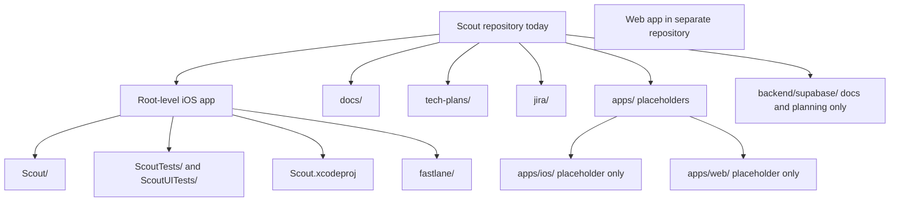
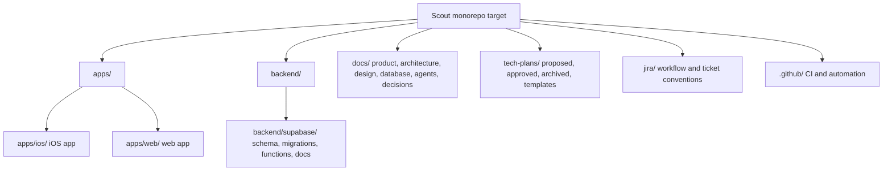

# Tech Plan: App Architecture Foundation

## Status

Approved

## Owner

TODO

## Product Domain

ARCH

## Purpose

This document is the architectural constitution for Scout. It defines how the system is organized, how engineering decisions are made, how ideas become shipped software, and when agents must stop to request architectural approval.

Every future technical plan, architecture decision, Jira epic, Jira story, and AI implementation task should reference this document when work affects system structure, repo organization, feature boundaries, backend ownership, database architecture, auth strategy, shared packages, or CI strategy.

## Do Not Move Yet

Existing iOS files must not be moved into `apps/ios/` until a dedicated iOS migration technical plan is approved.

This approved architecture foundation does not authorize moving source files, Xcode project files, package paths, schemes, CI configuration, Fastlane configuration, build settings, or tests. The current iOS app remains in its original root-level location.

## Current Approved State

- iOS remains at the repository root.
- Web remains in a separate repository.
- `apps/ios/` is a placeholder only.
- `apps/web/` is a placeholder only.
- `backend/supabase/` is documentation and planning only for now.
- Migration items are future planning only.
- No implementation tickets should be generated to move iOS or web from this plan.

## Authority

Scout planning and execution follow this authority model:

- `docs/product/PRODUCT.md` controls product direction.
- `docs/architecture/ARCHITECTURE.md` controls system structure.
- Architecture Decision Records in `docs/decisions/` control major architecture decisions.
- Approved tech plans in `tech-plans/approved/` control implementation of approved features or initiatives.
- Jira epics group approved work into delivery milestones.
- Jira stories control execution.

If these artifacts conflict, implementation must stop and the conflict must be resolved through planning before code changes proceed.

## Development Lifecycle

Scout's software factory converts ideas into shipped software through this lifecycle:

### Lifecycle Rules

- Product Vision defines what Scout should become and why.
- Architecture and ADRs define durable system choices and constraints.
- Approved tech plans define how a specific feature or initiative should be implemented.
- Jira epics organize approved work into coherent delivery tracks.
- Jira stories define small, executable units of work.
- Implementation must follow the approved plan and story scope.
- CI verifies the changed system before review.
- Code review checks correctness, maintainability, product intent, and plan alignment.
- Merge happens only after review and required validation.

Work should not skip stages. A small implementation ticket may have a lightweight plan, but any meaningful product, architecture, database, API, design system, or CI change must be traceable through this lifecycle.

## Problem Statement

Scout is currently an iOS repository that is being prepared to become a monorepo. The existing iOS app should not be moved yet, but future work needs a shared architecture foundation so iOS, web, Supabase, documentation, Jira, and AI-assisted development can evolve consistently.

Without a documented architecture foundation, future agents may create parallel patterns, move code prematurely, introduce inconsistent boundaries, or generate implementation tickets that depend on unapproved architecture decisions.

## Goals / Non-goals

### Goals

- Define the intended architecture planning process for Scout.
- Document current iOS app boundaries without moving code.
- Define future monorepo application boundaries.
- Establish approval gates for architecture-affecting changes.
- Define the authority chain from product docs to Jira execution.
- Require ADRs for major architecture decisions.
- Teach engineers and AI agents how engineering decisions are made within Scout.
- Make future AI implementation safer by clarifying where decisions must be documented.

### Non-goals

- Move the iOS app into `apps/ios/`.
- Move the web app into `apps/web/`.
- Change Xcode project references, package paths, schemes, CI, or build settings.
- Add shared packages or cross-platform code.
- Implement product features.
- Generate migration implementation tickets.

## Architectural Principles

### Feature-First Organization

Scout should be organized around product capabilities before technical layers. Features such as Profile, Swipe, Feed, Events, Auth, and future Chat should be understandable as coherent domains.

Feature-first organization helps humans and AI agents find relevant code, reason about ownership, and avoid scattering a single product concept across unrelated folders. Shared layers should exist only when multiple features have a real, repeated need.

### Modularity

Each feature should have a clear boundary and a clear reason to exist. A module should expose the minimum surface needed by other modules and keep internal details private where practical.

Modularity lets Scout grow without making every change risky. It also allows future agents to work in smaller areas with less accidental impact.

### Separation of Concerns

Views should render state and capture user intent. View models should coordinate presentation behavior. Repositories and services should own persistence, Supabase, storage, auth, and external integration details. Domain models should represent app-facing concepts.

Separation of concerns keeps product behavior testable and prevents UI, data access, and business rules from collapsing into one hard-to-change surface.

### Minimize Coupling

Features should not depend on each other's internal implementation details. Shared contracts should be explicit and documented.

Low coupling allows Profile, Swipe, Events, Chat, Feed, and future systems to evolve without hidden breakage. When coupling is necessary, the dependency should be named in the tech plan and Jira ticket.

### Maximize Cohesion

Related behavior should live together. A feature's models, view models, views, and data access should remain near that feature unless there is a strong reason to move them into a shared area.

High cohesion makes changes easier to review and helps AI agents avoid creating parallel patterns.

### Clear Abstractions Over Clever Implementations

Scout should prefer obvious, maintainable abstractions over clever, overly generic, or surprising implementations.

An abstraction is justified when it reduces real duplication, clarifies ownership, protects a boundary, or matches an established pattern. It is not justified merely because future reuse is imaginable.

### Design for AI-Assisted Development

Scout should be structured so AI agents can safely contribute:

- Plans should state goals, non-goals, dependencies, and validation steps.
- Files and feature areas should have predictable ownership.
- Tickets should be small and independently reviewable.
- Public contracts should be documented.
- Architecture-changing decisions should be captured before implementation.

AI agents are most effective when the repo makes the intended path obvious.

### Long-Term Maintainability Over Short-Term Speed

Scout should optimize for durable product development, not one-off speed. Fast work is valuable only when it does not create hidden maintenance debt, unclear ownership, or brittle coupling.

When short-term shortcuts are necessary, they should be documented with follow-up work and should not become silent architecture.

### Product Intent Drives Architecture

Architecture exists to support Scout's product goal: helping people connect offline through sports. Technical choices should preserve that intent across iOS, web, Supabase, and future systems.

## Architecture Change vs Feature Implementation

Agents must distinguish ordinary feature implementation from architectural change.

### Architectural Change

An architectural change alters system structure, ownership, boundaries, or long-term technical direction. It requires an ADR before implementation.

Examples:

- Moving the iOS app into `apps/ios/`.
- Migrating the web app into `apps/web/`.
- Creating shared packages between iOS and web.
- Changing backend ownership between Supabase, Edge Functions, or another service.
- Changing database architecture or migration strategy.
- Changing auth strategy or session ownership.
- Changing CI strategy, required checks, release gates, or deployment structure.
- Introducing a new cross-cutting service layer.
- Changing module boundaries or feature organization.
- Introducing cross-platform generated types or shared contracts.
- Replacing an established architecture pattern.

### Feature Implementation

A feature implementation works within approved boundaries to deliver a scoped product capability.

Examples:

- Adding a field to an already-approved screen and model contract.
- Implementing a Jira story from an approved tech plan.
- Adding view model tests for an existing feature.
- Extending an existing repository method under an approved API contract.
- Adding UI states defined by an approved design or feature plan.
- Fixing a bug without changing ownership, contracts, or system structure.

### When in Doubt

If a change affects more than one product domain, changes a public contract, changes persistence, alters auth or CI behavior, introduces shared infrastructure, or creates a new pattern future agents are expected to follow, treat it as architectural and require an ADR.

## User Stories

- As a product owner, I want architecture decisions documented before implementation so that long-term direction remains intentional.
- As an iOS engineer, I want current project paths preserved until migration is approved so that builds and Xcode references remain stable.
- As a future web engineer, I want clear boundaries for the future web app migration so that it can land without disrupting iOS.
- As an AI coding agent, I want approved plans and clear directories so that I can implement tickets without guessing.
- As a reviewer, I want architecture proposals separated from implementation so that risky decisions are visible.

## UX Flow

This plan has no direct end-user UX flow.

Developer workflow:

1. Product or technical need is identified.
2. Planning agent checks the authority chain.
3. Planning agent determines whether an ADR is required.
4. Planning agent drafts or updates the ADR when the change is architectural.
5. Planning agent drafts or updates a technical plan.
6. Owner approves, rejects, or requests changes.
7. Approved plans move to `tech-plans/approved/`.
8. Jira epics and stories are created from the approved plan.
9. Implementation agents execute only approved stories.
10. CI and code review verify implementation before merge.

## Architecture

### Current State

The iOS app currently remains at the repository root:

- `Scout/`
- `ScoutTests/`
- `ScoutUITests/`
- `Scout.xcodeproj`
- `fastlane/`
- root `Makefile`

The web app currently remains in a separate repository.

Current app organization is feature-oriented with SwiftUI and MVVM-style boundaries:

- `App`
- `AuthGate`
- `Data`
- `Design`
- `Domain`
- `Feed`
- `Profile`
- `Shared`
- `Swipe`

### Target State

The target monorepo shape should be reached through approved migration plans, not incremental ad hoc moves.

### Approved Structure for Now

The repository may contain planning placeholders for the future monorepo:

- `apps/ios/`: future iOS home, placeholder only.
- `apps/web/`: future web home, placeholder only.
- `backend/supabase/`: Supabase documentation and planning only.
- `docs/`: durable documentation.
- `tech-plans/`: planning workflow.
- `jira/`: ticket conventions.

This plan approves documenting and governing the architecture foundation. It does not approve application migration.

## ADR Requirements

An Architecture Decision Record is required before implementation for any change to:

- App structure.
- Backend ownership.
- Database architecture.
- Auth strategy.
- Shared packages.
- CI strategy.
- Module boundaries.
- Cross-platform contracts.
- Long-term technical direction.

ADRs should live in `docs/decisions/` and should be linked from the relevant tech plan and Jira tickets.

An ADR should explain:

- Context.
- Decision.
- Options considered.
- Consequences.
- Affected repo areas.
- Migration or rollout implications.
- Validation expectations.

## Implementation Ticket Requirements

Every implementation ticket must reference:

- Jira ticket key.
- Approved tech plan.
- Affected repo area: `iOS`, `web`, `Supabase`, `docs`, or `CI/CD`.

Tickets should also include scope, out of scope, acceptance criteria, dependencies, validation steps, and handoff expectations.

Implementation tickets should be small enough for focused development and review. A ticket that cannot explain its approved plan, affected area, and validation path is not ready for development.

## Database Changes

No database changes.

## API / Service Changes

No API or service changes.

Future API boundary proposals should be documented in `docs/architecture/API_BOUNDARIES.md` and feature-specific tech plans.

## UI Components

No UI components.

## Dependencies

- Existing repository structure.
- Existing iOS `Makefile`.
- Future owner approval for architecture decisions.
- Future ADR template and decision record workflow.
- Future Jira projects and issue types.

## Milestones

1. Approve architecture foundation.
2. Document the authority model.
3. Document the development lifecycle.
4. Document architectural principles.
5. Document ADR requirements.
6. Create documentation and planning Jira tickets.
7. Draft separate iOS migration plan only when ready.
8. Draft separate web migration plan only when ready.

## Risks

- Agents may treat placeholder directories as permission to move code.
- Future app migrations may be underestimated if Xcode, CI, and Fastlane impacts are not planned.
- Shared abstractions may be introduced too early before web requirements are known.
- Documentation may drift from code unless plans require updates.
- Jira tickets may become ambiguous if they do not reference the approved plan and affected repo area.
- Agents may implement architectural changes as feature work if ADR triggers are not enforced.

## Testing Strategy

Documentation-only validation:

- Verify files and directories exist.
- Verify docs accurately state that no app code has moved.
- Verify implementation ticket requirements are documented.
- Verify ADR triggers are documented.
- No iOS build required unless project files, build settings, package paths, or CI change.

Future migration validation should be defined in dedicated migration plans and may include:

- `make build`
- `make test`
- CI workflow validation.
- Xcode scheme validation.
- Fastlane validation if affected.

## Rollout Plan

1. Keep this plan in `tech-plans/approved/`.
2. Treat this plan as the architectural constitution for future planning and implementation.
3. Generate Jira tickets for architecture documentation and planning only.
4. Do not schedule implementation migration tickets until dedicated migration plans are approved.
5. Use this authority model and lifecycle when drafting future technical plans and Jira tickets.

## Definition of Done

- Architecture foundation plan approved.
- Current approved repository state documented clearly.
- Future monorepo direction documented as planned, not complete.
- Authority model documented.
- Development lifecycle documented.
- Architectural principles documented.
- Current and target architecture diagrams documented.
- ADR requirements documented.
- Implementation ticket requirements documented.
- Jira breakdown limited to documentation and planning follow-ups.

## Jira Breakdown Candidates

- `ARCH: Document architecture authority model`
- `ARCH: Create ADR template for major architecture decisions`
- `ARCH: Document current approved repository state`
- `ARCH: Document implementation ticket reference requirements`
- `ARCH: Document architecture change versus feature implementation rules`
- `ARCH: Draft iOS migration technical plan`
- `ARCH: Draft web migration technical plan`
- `ARCH: Document future monorepo CI planning questions`

These are documentation and planning tickets only. They must not include implementation work to move iOS, move web, restructure packages, change Xcode settings, or change CI behavior.

## Open Questions

- When should iOS migration planning begin?
- What ADR template should Scout use?
- Which CI jobs are required before web migration?
- Will shared contracts be generated, hand-written, or documented only?
- How should future agents verify they are following the authority chain?
