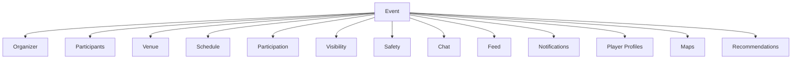
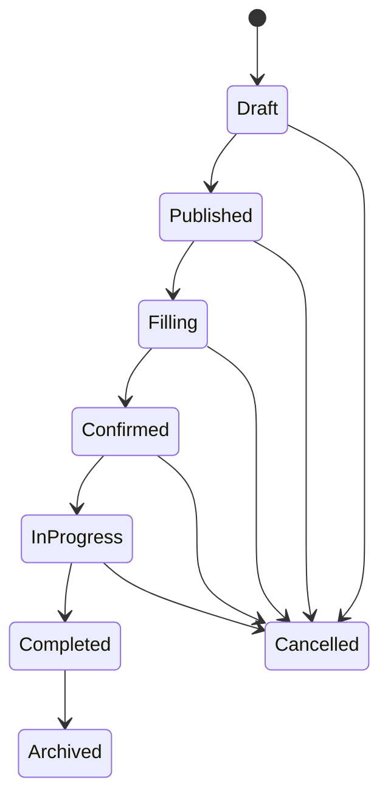

# Tech Plan: Real-World Sports Coordination

## Status

Approved

## Owner

TODO

## Product Domain

EVENT

## Purpose

This document is the authoritative technical plan for real-world sports coordination within Scout. Events are not merely records users create. They are coordination systems that help compatible players successfully get onto the court.

Every future Events, Feed, Chat, Maps, Profile, Notifications, Recommendations, Teams, Trust & Safety, and reputation feature should treat this plan as the conceptual authority for how real-world play is represented and coordinated.

## Problem Statement

Scout's long-term product goal is offline sports connection. Player matching is one path, but users also need ways to discover, join, organize, coordinate, complete, and reflect on real-world games.

An events system can help convert interest into actual play, but it affects location privacy, organizer permissions, participant state, notifications, communication, trust, moderation, maps, capacity, and future web surfaces. Without a shared conceptual model, future agents may treat events as simple CRUD objects instead of coordination workflows.

## Event Philosophy

Events exist to facilitate real-world play.

The primary success metric is completed games and positive player experiences, not the number of events created. Every Events feature should reduce friction between discovering a game and actually showing up.

Scout should optimize for:

- Helping players find compatible games.
- Helping organizers fill games with the right people.
- Reducing uncertainty before a player commits.
- Making location, time, expectations, and participation state clear.
- Encouraging reliable attendance.
- Supporting communication before, during, and after play.
- Protecting users with appropriate privacy and trust controls.

Scout should not optimize for event spam, empty listings, or keeping users browsing events instead of playing.

## Success Metrics

Events should be evaluated by whether they help real people successfully play together.

Conceptual success metrics:

- Completed games.
- Join conversion rate.
- Organizer reliability.
- Attendance rate.
- Cancellation rate.
- Participant satisfaction.
- Repeat participation.
- Time from discovery to committed participation.
- Ratio of confirmed events to abandoned or cancelled events.

Event creation volume is not a primary success metric. A smaller number of reliable, well-attended games is healthier than a large number of low-quality listings.

## Conceptual Model

Real-world coordination is modular:

```text
Real-World Sports Coordination
├── Event
├── Organizer
├── Participants
├── Venue
├── Schedule
├── Participation
├── Visibility
├── Communication
├── Safety
└── Lifecycle
```

This plan defines the conceptual domains. It does not decide the final database schema.

## Domain Invariants

The following rules must always remain true:

- Every Event has exactly one lifecycle state.
- Lifecycle transitions occur through approved state transitions only.
- Organizer permissions are authoritative.
- Participant state has a single source of truth.
- Visibility rules always override convenience.
- Consumers receive participation contracts rather than the full event model.
- Location precision must respect visibility, participation state, and safety rules.
- Participant actions must be valid for the current lifecycle state.
- Organizer actions must be valid for the current lifecycle state and permission model.
- Safety and trust rules must not be bypassed by UI-only shortcuts.

If implementation work would violate one of these invariants, it requires a new approved technical plan before proceeding.

## Conceptual Diagrams

### Event Relationships



### Event Lifecycle



## Coordination Domains

### Event

Event represents the central coordination object for a real-world game, open play session, meetup, clinic, or organized activity.

Candidate concepts:

- Title or label
- Sport
- Format
- Skill expectations
- Capacity
- Description
- Status
- Organizer
- Venue
- Schedule

### Organizer

Organizer represents the person or entity responsible for making the event viable.

Candidate responsibilities:

- Creating or publishing the event.
- Communicating expectations.
- Approving or managing participants when approval is required.
- Updating details.
- Managing capacity.
- Cancelling when needed.
- Maintaining trust through accurate information and reliable follow-through.

The organizer is not merely the creator. Future moderation and reputation systems should build on organizer behavior.

### Participants

Participants are users connected to an event through interest, request, RSVP, approval, waitlist, attendance, or completion.

Participant state should be explicit and centrally managed. Features should not invent one-off participant meanings.

### Venue

Venue represents where play happens.

Candidate concepts:

- Venue name
- Approximate location
- Exact location, when appropriate
- Court or field details
- Indoor or outdoor
- Parking or access notes

Location precision is a safety and privacy decision, not just a map display decision.

### Schedule

Schedule represents when play happens.

Candidate concepts:

- Date
- Start time
- End time
- Time zone
- Arrival buffer
- Recurrence, future
- Weather sensitivity, future

### Participation

Participation represents how a user moves from interest to showing up.

Candidate concepts:

- Join
- Request to join
- Approved
- Waitlisted
- Declined
- Left
- Removed
- Checked in, future
- No-show, future

Participation state must be governed by organizer permissions and event lifecycle.

### Visibility

Visibility controls who can discover, view, join, or share an event.

Candidate concepts:

- Public
- Nearby users
- Friends or connections
- Team-only
- Invite-only
- Hidden or archived

Visibility must consider safety, location precision, organizer intent, and participant privacy.

### Communication

Communication supports coordination before, during, and after play.

Candidate concepts:

- Event updates
- Organizer announcements
- Participant messages
- Chat link
- Notification copy
- Cancellation messages

Communication should help users show up prepared, not create noisy social feeds.

### Safety

Safety represents trust, moderation, privacy, and abuse prevention.

Candidate concepts:

- Abuse reporting
- Organizer verification
- Participant reputation
- Blocked users
- No-show handling
- Cancellation handling
- Location reveal rules

Safety decisions require explicit approval before implementation.

### Lifecycle

Lifecycle represents the event state machine from draft through completion or cancellation.

Lifecycle transitions should be centralized. Features should not mutate lifecycle state independently.

## Ownership Matrix

Events owns real-world coordination state. Other systems consume event contracts and should not become responsible for maintaining event data they only display or use.

| Domain | Owning System | Consumers | Boundary Rule |
| --- | --- | --- | --- |
| Event | Events | Feed, Search, Maps, Recommendations, Notifications, Chat, Profiles, Teams | Consumers may display approved summaries but must not redefine event identity or status. |
| Organizer | Events + Player Identity | Feed, Chat, Notifications, Profiles, Trust & Safety | Events owns organizer role and permissions; Player Identity owns organizer profile data. |
| Participants | Events + Player Identity | Chat, Notifications, Profiles, Feed, Recommendations, Teams | Events owns participation relationship; Player Identity owns player identity data. |
| Venue | Events / Maps | Feed, Maps, Notifications, Chat, Profiles | Events owns event-specific venue usage; Maps may own map presentation or venue lookup if approved. |
| Schedule | Events | Feed, Notifications, Chat, Calendar integrations, Recommendations | Events owns event timing and lifecycle-sensitive schedule changes. |
| Participation | Events | Feed, Chat, Notifications, Profiles, Recommendations | Events owns participant state and valid transitions. |
| Visibility | Events / Privacy | Feed, Search, Maps, Notifications, Recommendations, Web | Visibility gates all event contracts and overrides feature convenience. |
| Communication | Events / Chat / Notifications | Participants, Organizers, Feed, Profiles | Events owns event updates; Chat owns conversation mechanics; Notifications owns delivery surfaces. |
| Safety | Trust & Safety / Events | All event consumers | Safety rules override visibility, participation, and communication convenience. |
| Lifecycle | Events | All event consumers | Events owns lifecycle state and transitions; consumers must not mutate lifecycle independently. |

If a consuming feature needs event data outside its approved contract, it must propose a contract change through an approved tech plan.

## Event Lifecycle

Event lifecycle stages:

1. `Draft`
2. `Published`
3. `Filling`
4. `Confirmed`
5. `In Progress`
6. `Completed`
7. `Archived`
8. `Cancelled`

### Draft

Organizer can edit details freely. Event is not broadly discoverable. Participants generally cannot join.

### Published

Event is visible according to its visibility settings. Participants may view and take the approved participation action, such as join or request to join.

### Filling

Event has active participant interest but is not yet confirmed. Organizer may manage requests, capacity, and participant fit.

### Confirmed

Event has enough participants or organizer confirmation to proceed. Communication, reminders, and exact location reveal rules may change at this stage.

### In Progress

Event is actively happening. Participant actions may be limited. Check-in or live coordination may become relevant in future plans.

### Completed

Event has ended successfully. Follow-up, attendance, ratings, reputation, or recap behavior may become relevant in future plans.

### Archived

Event is retained for history, reputation, or analytics but is no longer active.

### Cancelled

Event will not happen. Participants should receive clear communication and recovery paths where possible.

Participant actions and organizer permissions must be defined for each lifecycle stage before implementation.

### SOCIAL-11 Lifecycle Transition and Permission Review

Jira story: `SOCIAL-11` (`Events: Define lifecycle transitions and permissions`).

This review documents conceptual lifecycle behavior for future implementation plans. It does not implement enums, state machines, database constraints, RLS policies, APIs, or UI.

Allowed lifecycle transitions:

| From State | Allowed Next States | Organizer Permission | Participant Behavior | Notes |
| --- | --- | --- | --- | --- |
| `Draft` | `Published`, `Cancelled` | Create, edit all draft details, publish, or cancel. | No broad participant action. Invited collaborators, if any, require future approval. | Draft events are not broadly discoverable. |
| `Published` | `Filling`, `Cancelled` | Update allowed pre-join details, manage visibility, cancel. | View event and take approved join/request action. | Transition to `Filling` when participant interest or requests exist. |
| `Filling` | `Confirmed`, `Cancelled` | Manage requests, capacity, participant fit, updates, cancellation. | Join/request/leave behavior depends on participation model and capacity. | Organizer decisions must be auditable in future plans if approval/decline exists. |
| `Confirmed` | `In Progress`, `Cancelled` | Confirm details, communicate updates, manage late changes, cancel with reason. | View coordination details allowed by visibility rules; leave/cancel participation rules require approval. | Exact location reveal rules may change here only through approved visibility guidance. |
| `In Progress` | `Completed`, `Cancelled` | Mark completion or cancel if the event cannot proceed. | Participant actions should be limited to coordination and future check-in if approved. | Live state should not permit broad edits that confuse participants. |
| `Completed` | `Archived` | Close out event and trigger approved follow-up. | Future feedback, attendance, or recap actions may apply. | No participation changes unless a future correction flow is approved. |
| `Archived` | None by default | Read historical record; administrative correction only if approved. | Read only where history is visible. | Reopening archived events is out of scope. |
| `Cancelled` | `Archived` | Provide cancellation reason and recovery guidance where applicable. | Receive safe cancellation/update information where notification support exists. | Reopening cancelled events is out of scope for v1. |

Invalid transition principles:

- Consumers must not mutate lifecycle state directly.
- Lifecycle transitions must have one authoritative path.
- Terminal states should not return to active states without a future approved correction process.
- Participant actions must not imply lifecycle transitions unless the approved Events implementation plan says so.
- Organizer actions must be valid for the current lifecycle state.
- Notifications, chat, maps, feed, and recommendations must react to lifecycle state; they must not define lifecycle behavior.

Conceptual permissions by lifecycle state:

| State | Organizer Can | Participant Can | Consumers Can |
| --- | --- | --- | --- |
| `Draft` | Edit, publish, cancel. | No broad action. | Usually hidden from public discovery/feed. |
| `Published` | Update approved details, cancel, manage visibility. | View and join/request if eligible. | Display Event Card/Detail according to visibility. |
| `Filling` | Manage participant requests, capacity, updates, cancel. | Join/request/leave according to participation rules. | Display capacity and participant summary without full event internals. |
| `Confirmed` | Communicate details, manage late changes, cancel with reason. | View allowed coordination details, leave only if approved. | Trigger reminders and summaries where notification strategy exists. |
| `In Progress` | Mark complete or cancel if needed. | Coordinate/check in only if later approved. | Suppress new joins unless explicitly approved. |
| `Completed` | Close out and initiate approved follow-up. | Provide future feedback/attendance signal if approved. | Show history/recap only through approved contracts. |
| `Archived` | Administrative read/correction only if approved. | Read allowed history only. | Exclude from active discovery. |
| `Cancelled` | Communicate cancellation and archive later. | Receive update and find alternatives where supported. | Remove from active discovery and show cancellation state where relevant. |

## Participation Contracts

Consumers should not receive the full event model by default. They should receive context-specific event summaries.

### SOCIAL-12 Event Contract Review

Jira story: `SOCIAL-12` (`Events: Define participation contracts`).

This review defines conceptual Event contracts for downstream planning. It does not create Swift models, APIs, queries, schema, views, RPCs, or services.

| Contract | Primary Consumers | Required Concepts | Excluded Concepts | Privacy / Visibility Boundary |
| --- | --- | --- | --- | --- |
| Event Card | Feed, Discovery, Search, Maps previews | Event ID, sport, time window, approximate location, skill expectation, capacity status, lifecycle state, organizer summary, primary action eligibility | Full description, exact location before allowed, full participant list, private organizer notes, internal ranking signals | Must respect event visibility, lifecycle, viewer eligibility, location precision, and blocked/restricted users. |
| Event Detail | Events, Maps, Chat entry, participant decision surfaces | Event identity, sport, schedule, venue detail appropriate to viewer, organizer summary, participant preview, participation state, lifecycle state, safety cues, allowed actions | Internal moderation notes, unrelated participant profile fields, exact location before allowed, raw recommendation scores | Detail depth depends on viewer relationship: non-participant, participant, organizer, admin/support. |
| Participant Summary | Event detail, organizer tools, Chat, Notifications, Profiles | Profile contract reference, participation state, role, eligibility/status label, approved trust cue if available | Full Player Identity, private availability, exact home area, raw reputation internals | Must use approved Player Identity contracts and event participation state; blocked/removed/restricted participants need safe representation. |
| Organizer Dashboard | Organizer tools, support/moderation planning | Event lifecycle state, capacity, participant requests, participant summaries, update/cancellation tools, moderation/reporting entry points | Raw recommendation internals, private participant profile fields, unsupported punitive reputation signals | Organizer permissions determine visibility; dashboard data must not leak beyond organizer/admin contexts. |
| Feed Preview | Feed, local activity surfaces | Event ID, sport, time, safe location label, capacity/urgency cue, short context, primary action eligibility | Full event detail, exact location before allowed, full participants, private organizer notes | Feed should use the smallest event preview that drives useful action without exposing location or participant details too early. |
| Notification Summary | Push/in-app notifications, email later if approved | Safe event label, time-sensitive update, actor reference through approved profile contract, required action, safe location language | Exact location unless already allowed, participant list, private notes, sensitive profile/event details | Push copy must assume lock-screen exposure; in-app notifications may use richer context only if visibility permits. |

Contract implementation surface remains open. Future implementation plans must decide whether contracts are app-layer projections, SQL views, RPCs, Edge Functions, or service responses before multiple clients consume them.

### Event Card

Purpose: help users quickly decide whether an event is relevant.

Likely concepts:

- Sport
- Time
- Approximate location
- Skill expectations
- Capacity status
- Organizer summary
- Primary action

### Event Detail

Purpose: provide enough context to commit, request, leave, or coordinate.

Likely concepts:

- Event description
- Organizer
- Participants or participant preview
- Schedule
- Venue details appropriate to visibility state
- Participation state
- Safety or trust cues
- Communication entry points

### Participant Summary

Purpose: show who is involved without exposing full player identity.

Likely concepts:

- Profile summary contract
- Participation state
- Role, such as organizer or participant
- Reputation or reliability signal, if approved

### Organizer Dashboard

Purpose: help organizers keep the event viable.

Likely concepts:

- Participant requests
- Capacity
- Lifecycle state
- Updates and announcements
- Cancellation tools
- Trust and moderation signals

### Feed Preview

Purpose: surface events in Feed without requiring full detail.

Likely concepts:

- Sport
- Time
- location level appropriate to viewer
- Short event context
- Capacity or urgency cue
- Primary action

### Notification Summary

Purpose: communicate important event changes safely and briefly.

Likely concepts:

- Event identity
- Time-sensitive update
- Organizer or participant reference
- Safe location language
- Required action or next step

Notifications should avoid leaking sensitive event or location details outside the app.

## Relationship Contracts

Events does not own player identity. Events consumes Player Identity contracts for organizers and participants.

For v1 planning, Events should reference `implementation/proposed/PROFILE-002-v1-identity-field-set.md` for Event Ready, Event Creator Ready, and Event Join Ready assumptions. Events must not redefine display identity, sport/skill requirements, profile photo requirements, visibility, discoverability, account status, or location precision.

Examples:

- Organizer display should use the Event Summary profile contract.
- Participant rows should use the Event Summary profile contract.
- Reputation or trust cues should use approved Player Identity or Reputation contracts when available.
- Events must not duplicate player profile fields to solve display needs.

Likewise, other domains should consume Event contracts rather than directly accessing the underlying event model:

- Feed consumes `Feed Preview`.
- Chat consumes `Event Detail`, `Participant Summary`, or a future chat-specific event context contract.
- Notifications consume `Notification Summary`.
- Maps consumes event venue/location contracts.
- Recommendations consume approved event relevance inputs.
- Player Profiles consume approved event history or participation summaries when those are approved.

This keeps ownership clear: Events owns event coordination; Profile owns player identity; Feed, Chat, Notifications, Maps, and Recommendations consume contracts.

## Organizer Responsibilities

Organizer responsibilities may include:

- Creating accurate event details.
- Setting appropriate skill and play expectations.
- Communicating changes promptly.
- Approving or declining participants when approval is required.
- Managing capacity and waitlists.
- Cancelling when the event is no longer viable.
- Updating venue or schedule details.
- Handling participant questions.
- Maintaining trust through reliable behavior.
- Supporting safety by reporting abuse or removing participants when appropriate.

Organizer tools should be powerful enough to keep games viable but constrained enough to protect participants from unfair or opaque behavior.

### SOCIAL-13 Organizer Responsibility Review

Jira story: `SOCIAL-13` (`Events: Document organizer responsibilities and trust rules`).

This review clarifies organizer responsibilities for future planning. It does not implement organizer dashboards, verification, reputation, moderation, messaging, participant states, or permissions.

Authoritative V1 organizer responsibilities:

| Responsibility | V1 Guidance | Future Hooks |
| --- | --- | --- |
| Event accuracy | Organizer is responsible for accurate sport, time, capacity, skill expectations, venue/location language, and description. | Repeated inaccurate events may inform future trust or moderation review. |
| Communication | Organizer should communicate material changes and cancellations clearly through approved update, notification, or chat surfaces. | Automated reminders, announcement tools, and event chat require later plans. |
| Participant fit | Organizer may approve, decline, remove, or waitlist participants only when the approved participation model allows it. | Approval history and fairness review may inform future moderation. |
| Capacity management | Organizer should keep capacity and participation state aligned with actual event viability. | Waitlist automation and capacity optimization are future work. |
| Cancellation | Organizer should cancel when the event is no longer viable and provide a reason or recovery path where supported. | Cancellation patterns may inform future reliability signals. |
| Safety escalation | Organizer may report abuse or unsafe behavior through approved safety channels. | Moderation workflow, evidence handling, and enforcement are future Trust & Safety work. |
| Trust maintenance | Organizer reliability is a product signal, but not a punitive v1 mechanic by itself. | Verification, reputation, badges, no-show handling, and organizer scoring require explicit approval. |

V1 permission boundaries:

- Organizer permissions are scoped to the event they organize.
- Organizer actions must be valid for the current event lifecycle state.
- Organizer permissions do not allow bypassing visibility, location precision, blocked-user, restricted-account, or participant privacy rules.
- Organizer decisions that affect participant access should be understandable and reviewable in future implementation plans.
- Organizer tools must not expose full Player Identity data; they consume approved profile contracts.
- Organizer actions that affect notifications, chat, maps, recommendations, or feed visibility require approved downstream contracts.

Deferred trust and reputation hooks:

- Organizer verification.
- Organizer reliability score.
- Participant reputation or attendance score.
- No-show penalties.
- Late-cancellation penalties.
- Automated moderation or enforcement.
- Public organizer badges.
- Organizer dashboard analytics.

These hooks should remain conceptual until approved Trust & Safety, reputation, analytics, and Events implementation plans define data ownership, fairness rules, appeal/recovery behavior, and privacy boundaries.

## Safety & Trust Principles

Safety and trust are first-class event concerns.

Conceptual principles:

- Approximate locations may be appropriate before joining.
- Exact locations should be revealed only when the user has the appropriate participation or visibility state.
- Organizer verification may become important for public or high-attendance events.
- Participant reputation may help users decide whether to join.
- Abuse reporting should be available for events, organizers, and participants.
- No-shows and late cancellations may eventually affect reputation or organizer tools.
- Blocked users should not be forced into shared event contexts without explicit safety review.
- Event visibility should respect player privacy and organizer intent.
- Safety decisions should not be hidden inside UI-only logic.

These are conceptual principles only. They do not approve implementation details.

### SOCIAL-14 Safety Visibility and Location Review

This review defines conceptual safety and location guidance for Events V1. It does not approve location precision logic, reporting flows, moderation policy, RLS, storage policy, or implementation-specific enforcement.

Visibility rules must override convenience. Event consumers should receive only the information needed for their current relationship to the event, and exact location details must not be exposed simply because they make discovery, notifications, maps, or feed cards easier to build.

Conceptual visibility rules:

| Viewer or state | Appropriate V1 visibility | Safety boundary |
| --- | --- | --- |
| Discovery viewer | Sport, time window, approximate location, capacity status, skill expectations, organizer summary, and safe primary action. | Do not reveal exact address, court details, access notes, full participant list, or private participant profile details. |
| Pre-join detail viewer | Event description, schedule, approximate venue area, participation requirements, organizer summary, and safe trust cues. | Exact location and private participant context remain gated by participation, lifecycle, and safety rules. |
| Pending participant | Request status, organizer response path, and any detail needed to understand whether the request is still viable. | Pending state alone should not guarantee exact location reveal. |
| Approved or joined participant | Coordination detail appropriate to the event lifecycle, including exact location only when approved by the final implementation plan. | Location reveal timing must be explicit and testable before implementation. |
| Organizer | Full owned-event management context, participant requests, lifecycle controls, and safety controls approved for V1. | Organizer tools must remain bounded by participant privacy and abuse-prevention rules. |
| Cancelled or archived event viewer | Safe event status, relevant recovery path, and historical context where approved. | Cancelled or archived events should not remain active discovery surfaces or leak stale coordination details. |

Location precision rules:

- Approximate location may mean city, neighborhood, venue area, park area, or another coarse location label approved by the implementation plan.
- Exact location may include street address, named court, reservation details, entry notes, parking notes, or any instruction that materially helps someone find the participants.
- Exact location reveal must be gated by event visibility, participation state, lifecycle state, organizer intent, and safety review.
- Notifications, feed previews, maps, and shared links must use the same location precision contract as the in-app event consumer they represent.
- Profile privacy contracts from `PROFILE-001` apply to event participants and organizers; Events must consume context-appropriate profile summaries rather than full Player Identity records.

Safety topics requiring future approval before implementation:

- Abuse reporting, escalation, and moderation handoff.
- Blocked-user discovery, joining, and co-participation behavior.
- Organizer verification and organizer trust signals.
- Participant list visibility by lifecycle state and viewer relationship.
- Exact location reveal timing and revocation behavior.
- No-show, late-cancellation, and reliability consequences.
- Safety-oriented notification copy and redaction rules.
- RLS, service-layer enforcement, and audit requirements.

Open questions requiring approval before implementation:

- Which concrete visibility states are required for Events V1?
- At what lifecycle and participation state can exact location be revealed?
- Can pending participants see participant previews, organizer contact paths, or venue names?
- How should blocked users affect discovery, event detail access, joining, and organizer management?
- What is the minimum abuse reporting surface required for V1 launch?
- Which organizer verification signals, if any, are required before public event discovery?
- Who can see the participant list, and how much profile context can each viewer see?
- How should cancelled events handle recovery paths without leaking stale location details?

## Downstream Consumers

Event data is consumed across Scout. Any event change must consider downstream consumers.

Known and future consumers:

- Feed
- Notifications
- Chat
- Maps
- Player Profiles
- Recommendations
- Future Teams
- Search
- Calendar integrations, future
- Reputation and ratings, future
- Future web event pages

Event changes should document:

- Which consumers are affected.
- Which participation contract is affected.
- Whether location precision changes.
- Whether organizer permissions change.
- Whether participant actions change.
- Whether notification copy changes.
- Whether recommendations or ranking are affected.

## Future Extensions

The Events domain should remain extensible for:

- Tournaments.
- Recurring events.
- Leagues.
- Clubs.
- Skill-based matchmaking.
- Weather handling.
- Court reservations.
- Payments.
- Equipment lending.
- Recurring organizer tools.
- Calendar integrations.
- Check-in and attendance verification.
- Post-game recaps.

These should not be implemented now. They should influence extensibility by preventing narrow assumptions that would make future real-world coordination systems difficult.

New event capabilities should extend the existing conceptual model rather than creating parallel event systems. Every new feature should either consume an existing Event contract or propose a new contract through an approved tech plan.

## Versioning Guidance

V1 should focus on lightweight community games and coordination.

V1 should prioritize:

- Discovering relevant games.
- Understanding time, place, skill expectations, and capacity.
- Joining or requesting to join.
- Organizer updates and basic participant management.
- Clear cancellation and recovery paths.
- Safe, appropriate location visibility.

Future versions may add:

- Advanced organizer tooling.
- Leagues.
- Tournaments.
- Payments.
- Automation.
- Recurring events.
- Court reservations.
- Richer maps.
- Weather-aware coordination.

Advanced features should not expand v1 scope unless explicitly approved. They should be introduced through new versioned plans that preserve existing lifecycle, ownership, visibility, and contract assumptions.

### SOCIAL-10 V1 Community Game Scope

Jira story: `SOCIAL-10` (`Events: Define V1 community game scope and success metrics`).

This review narrows the approved EVENT-001 direction into the V1 implementation-planning baseline. It does not authorize UI, schema, service, notification, chat, map, payment, reservation, league, or tournament implementation.

V1 should support lightweight community games where one organizer helps compatible players coordinate real-world play.

In V1 scope:

- Single-session community games or open-play style meetups.
- One organizer responsible for event accuracy, updates, cancellation, and participant coordination.
- One sport per event.
- Clear time, approximate location, skill expectation, capacity, and participation status.
- Join or request-to-join flow, depending on the future participant-permission plan.
- Basic participant list or participant summary, subject to approved Event and Player Identity contracts.
- Basic organizer updates and cancellation messaging, subject to future notification/chat plans.
- Location visibility that starts coarse and reveals more detail only through approved visibility rules.

Out of V1 scope unless a later approved plan explicitly expands it:

- Tournaments.
- Leagues.
- Payments.
- Court or venue reservations.
- Recurring-event automation.
- Advanced organizer dashboard workflows.
- Automated waitlist optimization.
- Attendance verification or check-in.
- No-show scoring or reputation penalties.
- Public web event pages.
- Weather automation.
- Club or team management.

V1 success metrics should prioritize completed, positive play outcomes:

| Metric | Why It Matters | Planning Notes |
| --- | --- | --- |
| Completed games | Measures whether Scout turns interest into actual play. | Primary health signal; should outweigh raw event creation count. |
| Join conversion | Shows whether event detail and expectations are clear enough to commit. | Interpret with capacity and visibility context. |
| Attendance rate | Measures reliability after commitment. | Requires careful future attendance semantics before punitive use. |
| Cancellation rate | Surfaces organizer reliability and event quality issues. | Track organizer-initiated and participant-initiated cancellations separately in future plans. |
| Organizer reliability | Indicates whether organizers keep event details accurate and communicate changes. | Reputation or trust use remains future work. |
| Participant satisfaction | Captures whether the game was worthwhile after completion. | Collection method is future analytics/product work. |
| Repeat participation | Shows whether Events creates durable real-world value. | Should be interpreted alongside safety and inclusion signals. |

Event creation volume is a diagnostic signal only. It should not be treated as a V1 success metric unless paired with completion, attendance, cancellation, and satisfaction outcomes.

## Goals / Non-goals

### Goals

- Define real-world sports coordination as the purpose of Events.
- Define conceptual coordination domains.
- Define domain invariants.
- Define ownership boundaries.
- Define event lifecycle stages.
- Define participation contracts for downstream consumers.
- Define relationship contracts between Events and other domains.
- Expand organizer responsibilities.
- Establish safety and trust principles.
- Define success metrics.
- Reserve space for future extensions.
- Define versioning guidance.
- Document downstream event consumers.
- Prepare future Jira tickets after approval.
- Keep the initial implementation scope small enough for incremental delivery.

### Non-goals

- Implement event creation or event joining.
- Add database tables.
- Decide final schema or participant state machine implementation.
- Add maps, payments, chat, or calendar integrations.
- Build advanced league, tournament, or club management.
- Replace swipe or profile flows.

## User Stories

- As a player, I want to find upcoming games near me so that I can play.
- As a player, I want to see skill expectations, time, location, and capacity before joining.
- As a player, I want confidence that a game is real, safe, and worth showing up for.
- As an organizer, I want to fill a game with compatible players so that the game actually happens.
- As an organizer, I want to manage participant state so that the game stays viable.
- As an organizer, I want tools to communicate changes clearly so that participants show up prepared.
- As a participant, I want updates when event details change so that I do not miss important information.
- As an AI implementation agent, I want lifecycle, contract, and permission rules so that event behavior stays consistent.

## UX Flow

### Discover Events

1. User opens events or feed surface.
2. App loads relevant upcoming events.
3. User scans event cards.
4. User opens event detail.
5. User joins, requests to join, or leaves based on lifecycle and visibility.

### Create Event

1. User starts event creation.
2. User enters sport, date, time, location, skill expectations, and capacity.
3. App validates required fields.
4. App saves draft or publishes event according to approved flow.
5. Event appears in relevant discovery surfaces when visible.

### Manage Event

1. Organizer opens event detail or dashboard.
2. Organizer updates details, lifecycle, or participant state.
3. App notifies affected participants if notification support exists.
4. Event state updates across consumers.

### Attend Event

1. Participant receives reminders or updates.
2. Participant gets appropriate location and coordination details.
3. Participant shows up and plays.
4. Event transitions to completed or another appropriate lifecycle state.

## Architecture

Potential relevant areas:

- Future `Scout/Events` feature area or equivalent.
- `Scout/Feed` if events initially appear in feed.
- `Scout/Profile` for organizer and participant summaries.
- `Scout/Data` for event repository and Supabase access.
- `backend/supabase` for schema, RLS, and future functions.
- Future `apps/web` for event web surfaces after migration.

### Approved Direction

Adding an events feature area, event schema, lifecycle state machine, participant state model, RLS policies, notification behavior, organizer permissions, safety rules, and location model requires explicit approval before implementation.

## Database Changes

No database schema is approved by this plan.

Potential future schema areas requiring approval:

- `events`
- `event_participants`
- `event_updates`
- Event location or venue representation.
- Event visibility.
- Event lifecycle status.
- Participant status such as invited, requested, joined, waitlisted, declined, removed, checked in, no-show, or cancelled.
- Capacity and waitlist rules.
- Organizer permissions.
- Safety and reporting records.

Schema work should be generated through later tickets after lifecycle, participation, visibility, and safety rules are approved.

## API / Service Changes

No API or service changes are approved by this plan.

Potential future operations:

- Fetch event list.
- Fetch event detail.
- Fetch event card summaries.
- Fetch organizer dashboard.
- Create draft event.
- Publish event.
- Update event.
- Cancel event.
- Join or request to join.
- Leave event.
- Manage participant state.
- Transition lifecycle state.
- Notify participants.
- Report event, organizer, or participant.

Operations involving authorization, participant state transitions, lifecycle transitions, location reveal, safety, or notifications may need server-side authority.

## UI Components

Likely UI components:

- Event card.
- Event detail screen.
- Event creation form.
- Organizer dashboard.
- Date and time picker.
- Location field.
- Skill expectation selector.
- Capacity control.
- Participant list.
- Join/request/leave button.
- Organizer controls.
- Event update composer.
- Safety or report entry point.
- Empty, loading, and error states.

## AI Rules

Future AI agents must:

- Never create new participant states without an approved tech plan.
- Never bypass organizer permissions.
- Keep event lifecycle transitions centralized.
- Reuse existing event summaries instead of creating feature-specific models.
- Use participation contracts instead of giving every feature the full event model.
- Respect domain invariants.
- Preserve ownership boundaries from the ownership matrix.
- Use Player Identity contracts for organizer and participant display instead of duplicating profile data.
- Use `PROFILE-002` v1 identity readiness assumptions before adding event-specific gates.
- Require approved contract changes when a consumer needs event data outside its current contract.
- Document affected downstream consumers for every event change.
- Document location precision and visibility implications for every event change.
- Document organizer permission impacts for every event change.
- Treat safety and trust behavior as product and architecture decisions, not incidental UI logic.

## Dependencies

- Player Identity contracts for organizer and participant display.
- `PROFILE-002` Event Ready, Event Creator Ready, and Event Join Ready assumptions.
- Design system for event cards, forms, feedback, and safety states.
- Database and RLS decisions.
- Location precision and privacy decisions.
- Notification strategy.
- Chat strategy for event communication.
- Maps strategy for venue display.
- Future web migration if events need public or shareable pages.

## Milestones

1. Approve real-world coordination conceptual model.
2. Approve domain invariants and ownership matrix.
3. Approve event lifecycle and participant permission model.
4. Approve participation and relationship contracts.
5. Approve success metrics.
6. Approve safety, trust, and location precision principles.
7. Define UI flows for discovery, detail, create, manage, and attend.
8. Plan schema and service changes in later tickets.
9. Create backend Jira tickets after schema approval.
10. Create iOS UI and repository tickets after design and API approval.
11. Add tests and validation.

## Risks

- Event scope may expand into complex organizer tooling too early.
- Location data may create privacy or safety concerns.
- Participant state transitions may be hard to enforce client-side.
- Notifications may become required for a usable experience.
- Empty event inventory may make the feature feel inactive.
- Event count may become a vanity metric if completed games are not prioritized.
- Organizer tools may create unfair participant experiences if permissions are unclear.
- Feature-specific event models may fragment lifecycle and privacy rules.
- No-show or cancellation handling may feel punitive if not designed carefully.
- Advanced organizer tooling, leagues, tournaments, or payments may bloat v1 scope.
- Consumers may bypass contracts if ownership boundaries are not enforced.
- Event metrics may optimize for joins rather than completed, positive play experiences.

## Testing Strategy

Conceptual planning validation:

- Confirm coordination domains are documented.
- Confirm domain invariants are documented.
- Confirm ownership matrix is documented.
- Confirm lifecycle stages are documented.
- Confirm participation contracts are documented.
- Confirm relationship contracts are documented.
- Confirm organizer responsibilities are documented.
- Confirm success metrics are documented.
- Confirm future extensions and versioning guidance are documented.
- Confirm downstream consumers are documented.
- Confirm no final schema is implied.

Future implementation should include:

- Unit tests for event form validation.
- Unit tests for lifecycle state transitions.
- Unit tests for participant state transitions.
- Permission tests for organizer-only actions.
- Contract tests for Event Card, Event Detail, Participant Summary, Organizer Dashboard, Feed Preview, and Notification Summary if implemented.
- Contract boundary tests for downstream consumers if implemented.
- Repository tests for event fetch/create/update where feasible.
- RLS policy tests or documented manual verification.
- Manual QA for event discovery, detail, join, leave, organizer, cancellation, and notification flows.
- Location precision and visibility QA.
- `make build` and relevant `make test` validation for iOS changes.

## Rollout Plan

1. Use this plan as the authoritative real-world coordination document.
2. Approve a narrow v1 event scope.
3. Plan schema, lifecycle, contracts, permissions, and safety implementation separately.
4. Consider internal or limited-market testing first.
5. Monitor completed games, join conversion, organizer reliability, attendance, cancellations, participant satisfaction, and repeat participation.
6. Add notifications, waitlists, chat, maps, or organizer tools through follow-up plans.

## Definition of Done

- Real-world coordination philosophy approved.
- Conceptual coordination domains approved.
- Domain invariants approved.
- Ownership matrix approved.
- Event lifecycle approved.
- Participation contracts approved.
- Relationship contracts approved.
- Organizer responsibilities documented.
- Safety and trust principles documented.
- Success metrics documented.
- Future extensions documented.
- Versioning guidance documented.
- Downstream consumers documented.
- Event schema and RLS plan approved in later plans where needed.
- Event UX flows approved before implementation.
- Jira tickets created and sequenced only after relevant approvals.
- Event discovery and participation work as planned.
- Tests and validation pass for implemented work.
- Documentation updated.

## Jira Breakdown Candidates

- `EVENT: Approve real-world coordination conceptual model`
- `EVENT: Document domain invariants`
- `EVENT: Document event ownership matrix`
- `EVENT: Document event lifecycle state machine`
- `EVENT: Define participant permission matrix`
- `EVENT: Define Event Card contract`
- `EVENT: Define Event Detail contract`
- `EVENT: Define Participant Summary contract`
- `EVENT: Define Organizer Dashboard contract`
- `EVENT: Define Feed Preview contract`
- `EVENT: Define Notification Summary contract`
- `EVENT: Document safety and location precision rules`
- `EVENT: Document event success metrics`
- `EVENT: Document event versioning guidance`
- `EVENT: Define event relationship contracts`
- `EVENT: Plan event schema changes`
- `EVENT: Plan event service boundaries`

These are planning tickets unless later approval authorizes implementation.

## Open Questions

- Is v1 focused on user-created games, curated events, or both?
- Should joining be instant or request-based?
- How precise should event location be before joining?
- When is exact location revealed?
- Are notifications required for v1?
- Should events be visible to unmatched users?
- Does web need public event pages?
- What participant states are required for v1?
- What domain invariants need automated tests in v1?
- What organizer actions require confirmation?
- Should organizer reputation affect event visibility?
- How should no-shows be handled?
- How should late cancellations be handled?
- Should event chat be required for confirmed events?
- How should blocked users affect event discovery and participation?
- What event data should appear on player profiles?
- Which Event contracts are required for v1?
- How should Event contract changes be versioned?
- Which success metrics are required before launch?
