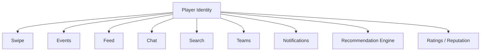

# Tech Plan: Player Identity & Profile System

## Status

Approved

## Owner

TODO

## Product Domain

PROFILE

## Purpose

This document is the canonical technical plan for player identity within Scout. It defines the conceptual model, ownership boundaries, profile contracts, lifecycle, privacy posture, and extensibility rules that future Profile, Swipe, Events, Feed, Chat, Teams, Search, Notifications, Ratings, and recommendation work must follow.

Player Identity is not a CRUD surface. It is the shared representation of who a player is inside Scout and how that identity is safely consumed across the product.

## Problem Statement

Scout's core loop depends on a high-quality player identity system, not just editable profile fields. A Scout profile represents a player's identity within the Scout ecosystem and is consumed by Swipe, Events, Teams, Chat, Feed, Ratings, and future recommendation systems.

Players need to express who they are, what they play, how they like to play, when they are available, how they want to be discovered, and what social context makes them trustworthy. Other product systems need a consistent way to display and reason about that identity without exposing private information or creating inconsistent profile experiences.

The existing app has profile-related code, but the broader Player Identity & Profile System needs a conceptual model before expanding fields, storage, editing flows, backend schema, or cross-feature profile consumption.

## Guiding Principles

- Identity should be additive rather than destructive.
- Profile information should have a single source of truth.
- Every profile field should have a clear product purpose.
- Privacy should default toward protecting the user.
- Profile changes should not unexpectedly affect unrelated systems.
- Consumers should receive context-appropriate profile contracts, not the full Player Identity model.
- Missing profile information should degrade gracefully.
- Profile data should support real-world play, not vanity metrics.
- New identity capabilities should extend the existing conceptual model rather than creating parallel profile systems.

## Conceptual Model

Player Identity is modular:

```text
Player Identity
├── Identity
├── Sports
├── Availability
├── Preferences
├── Social
├── Privacy
├── Reputation
└── System
```

This plan defines the conceptual domains. It does not decide the final database schema.

## Conceptual Diagrams

### Player Identity Consumers



### Domains to Profile Contracts

```mermaid
flowchart TB
    subgraph Domains["Player Identity Domains"]
        Identity["Identity"]
        Sports["Sports"]
        Availability["Availability"]
        Preferences["Preferences"]
        Social["Social"]
        Privacy["Privacy"]
        Reputation["Reputation"]
        System["System"]
    end

    subgraph Contracts["Profile Contracts"]
        SwipeSummary["Swipe Summary"]
        EventSummary["Event Summary"]
        ChatSummary["Chat Summary"]
        PublicProfile["Public Profile"]
        EditableProfile["Full Editable Profile"]
        NotificationSummary["Notification Summary"]
        SearchSummary["Search Summary"]
    end

    Identity --> SwipeSummary
    Sports --> SwipeSummary
    Availability --> SwipeSummary
    Privacy --> SwipeSummary

    Identity --> EventSummary
    Sports --> EventSummary
    Availability --> EventSummary
    Reputation --> EventSummary
    Privacy --> EventSummary

    Identity --> ChatSummary
    Social --> ChatSummary
    Privacy --> ChatSummary

    Identity --> PublicProfile
    Sports --> PublicProfile
    Availability --> PublicProfile
    Social --> PublicProfile
    Reputation --> PublicProfile
    Privacy --> PublicProfile

    Identity --> EditableProfile
    Sports --> EditableProfile
    Availability --> EditableProfile
    Preferences --> EditableProfile
    Social --> EditableProfile
    Privacy --> EditableProfile
    Reputation --> EditableProfile
    System --> EditableProfile

    Identity --> NotificationSummary
    System --> NotificationSummary
    Privacy --> NotificationSummary

    Identity --> SearchSummary
    Sports --> SearchSummary
    Availability --> SearchSummary
    Privacy --> SearchSummary
```



## Player Identity Domains

### Identity

Identity represents who the player is to other people in Scout.

Candidate concepts:

- Name
- Username
- Profile photo
- Action photo
- Bio

Identity fields should support trust, recognition, and human connection. They should not make Scout feel like a dating app; sports context and play intent should remain central.

### Sports

Sports represent what the player plays and how they participate.

Candidate concepts:

- Sports
- Primary sport
- Skill level or skill levels
- Preferred positions, future
- Years playing, future

Sports data should be extensible beyond pickleball without forcing the v1 app to solve every sport-specific modeling problem upfront.

### Availability

Availability represents when and where a player is realistically open to playing.

Candidate concepts:

- Preferred days
- Preferred times
- Competitive versus casual intent
- Travel radius
- Home area

Availability should support recommendations, events, and coordination while avoiding heavy setup during onboarding.

### Preferences

Preferences represent how a player wants Scout to personalize discovery and coordination.

Candidate concepts:

- Preferred play formats
- Preferred skill range
- Preferred age or group constraints if ever approved
- Preferred venue types
- Notification preferences
- Match or event discovery preferences

Preference fields require product review because they can affect inclusion, discovery quality, and user safety.

### Social

Social identity represents a player's connections and community context.

Candidate concepts:

- Friends
- Teams
- Badges
- Reputation
- Ratings, future
- Mutual connections

Social data should help users make confident decisions without turning Scout into a generic social network.

### Privacy

Privacy represents what is visible, discoverable, hidden, or restricted.

Candidate concepts:

- Visibility
- Discoverability
- Blocked users
- Hidden sports
- Location precision

Privacy rules must be explicit before implementation. Future agents must not expose private fields without approval.

### Reputation

Reputation represents trust signals earned or verified inside Scout.

Candidate concepts:

- Ratings, future
- Badges
- Achievements
- Attendance reliability
- Host reputation
- Verified player or organization signals

Reputation should be designed carefully to avoid unfair, opaque, or punitive behavior.

### System

System fields support lifecycle, moderation, and product behavior.

Candidate concepts:

- Account status
- Profile completion
- Verification
- Created date
- Last active

System fields are not automatically public profile fields. Visibility must be decided intentionally.

## Ownership Matrix

Profile owns Player Identity data. Other systems consume profile contracts and should not become responsible for maintaining profile data they only display or use.

| Domain | Owning System | Consumers | Boundary Rule |
| --- | --- | --- | --- |
| Identity | Profile | Swipe, Events, Feed, Chat, Teams, Search, Notifications, Recommendations | Consumers may display approved summaries but must not redefine identity fields. |
| Sports | Profile | Swipe, Events, Feed, Teams, Search, Recommendations | Consumers may filter or display sports context through contracts. |
| Availability | Profile | Swipe, Events, Feed, Search, Recommendations, Notifications | Consumers may use availability for relevance but should not own source availability data. |
| Preferences | Profile | Recommendations, Swipe, Events, Notifications | Preferences should influence personalization without being broadly exposed. |
| Social | Social / Profile | Feed, Chat, Teams, Events, Search, Recommendations | Social systems may own relationship edges; Profile owns how social context appears in identity contracts. |
| Privacy | Profile / Auth / Trust & Safety | All consumers | Privacy rules gate every contract and override feature convenience. |
| Reputation | Reputation / Profile | Swipe, Events, Teams, Search, Feed | Reputation systems may compute signals; Profile owns identity-level presentation rules. |
| System | Auth / Profile | Notifications, Recommendations, Trust & Safety, Admin, Feature Gates | System fields support lifecycle and moderation; most are not user-facing. |

If a feature needs profile data outside its approved contract, it must propose a contract change through an approved tech plan.

## Profile Contracts

Consumers should not receive the entire Player Identity model by default. They should receive conceptual contracts that expose only the fields appropriate for the context.

### Swipe Summary

Purpose: help a player decide whether another player seems compatible for play.

Likely domains:

- Identity
- Sports
- Availability
- Privacy
- Reputation, if approved

Should avoid private preferences and system-only lifecycle fields.

### Event Summary

Purpose: help users understand organizers and participants before joining or managing an event.

Likely domains:

- Identity
- Sports
- Availability
- Reputation
- Privacy

Should present only event-appropriate location and availability context.

### Chat Summary

Purpose: identify conversation participants and provide enough context for coordination.

Likely domains:

- Identity
- Social
- Privacy
- System, only when needed for status or safety

Should avoid overloading chat with full profile details.

### Public Profile

Purpose: provide a broader profile view appropriate for discovery or social context.

Likely domains:

- Identity
- Sports
- Availability, filtered
- Social, filtered
- Reputation, filtered
- Privacy

Public Profile must respect visibility context such as pre-match, post-match, friend, event participant, or public web.

### Full Editable Profile

Purpose: allow the profile owner to view and edit their own identity.

Likely domains:

- Identity
- Sports
- Availability
- Preferences
- Social, where editable
- Privacy
- Reputation, mostly read-only
- System, mostly read-only

This is the broadest contract and should be available only to the profile owner or authorized administrative contexts.

### Search Summary

Purpose: support quick comparison in search or discovery results.

Likely domains:

- Identity
- Sports
- Availability, filtered
- Privacy

Search should be careful with location precision and discoverability.

### Notification Summary

Purpose: provide short, safe identity references in notification copy.

Likely domains:

- Identity
- Privacy
- System, only when needed

Notifications should avoid leaking sensitive profile details outside the app.

## Profile Completion Philosophy

The profile should progressively unlock. Scout should encourage completion rather than require everything upfront.

Example completion model:

- `20%`: account created
- `40%`: sports selected
- `60%`: profile photo added
- `80%`: availability added
- `100%`: bio, action photo, and preferences added

Completion should:

- Help users understand why each field matters.
- Avoid blocking first meaningful discovery unless a field is essential.
- Use lightweight prompts instead of heavy setup screens when possible.
- Make incomplete profiles usable but clearly improvable.
- Support feature-specific completion prompts, such as adding availability before joining events.

The exact completion scoring and required fields require later approval.

## Player Identity Lifecycle

Player Identity should evolve over time:

1. `Account Created`: user has authenticated, but identity may be minimal.
2. `Basic Identity`: user has enough identity to be recognized by themselves and the system.
3. `Discovery Ready`: user has enough sports and visibility information to participate in discovery.
4. `Active Player`: user participates in matches, games, events, or conversations.
5. `Trusted Community Member`: user has earned trust signals through participation, reliability, reputation, or verification.

The lifecycle supports progressive onboarding, contextual prompts, and future reputation systems. It should not be used to shame users or block value unnecessarily.

## Profile Consumption

Profile data is consumed across Scout. Any profile change must consider downstream consumers.

Known and future consumers:

- Swipe cards
- Recommendation engine
- Events
- Team pages
- Chat headers
- Feed
- Search
- Notifications
- Onboarding
- Profile editing
- Public profile preview
- Match modal
- Event participant lists
- Organizer summaries
- Ratings and reputation surfaces
- Future web profile pages

Profile changes should document:

- Which consumers are affected.
- Which contract is affected.
- Whether the data is public, match-visible, event-visible, friend-visible, owner-visible, system-only, or private.
- What fallback appears when data is missing.
- Whether the change affects recommendations or ranking.
- Whether the change affects notification copy.

## Future Extensions

The Player Identity System should remain extensible for:

- Teams
- Ratings
- Achievements
- League history
- Verified organizations
- Clubs
- Equipment preferences
- Favorite venues

These should not be implemented now. They should influence extensibility by preventing narrow profile assumptions that would make future identity surfaces difficult.

New identity domains should extend the existing conceptual model rather than creating parallel profile systems. Every new feature should either consume an existing profile contract or propose a new contract through an approved tech plan.

## Goals / Non-goals

### Goals

- Define Scout's conceptual Player Identity model.
- Split profile data into logical domains.
- Establish ownership boundaries for identity domains.
- Define profile contracts for downstream consumers.
- Establish progressive profile completion philosophy.
- Document the player identity lifecycle.
- Document systems that consume profile data.
- Identify privacy and visibility as first-class concerns.
- Preserve extensibility for teams, events, chat, ratings, reputation, and future recommendations.
- Set the quality standard for future domain-level technical plans.

### Non-goals

- Implement profile UI changes.
- Decide the final database schema.
- Change database schema.
- Add or change Supabase storage buckets.
- Migrate existing user data.
- Build messaging, teams, ratings, or event participation.
- Define all future multi-sport behavior.
- Expose new public profile fields.

## User Stories

- As a new player, I want to create enough identity quickly so that I can start discovering other players.
- As a returning player, I want to improve my profile over time so that Scout can better match me with people and games.
- As a browsing player, I want to see relevant sports, skill, availability, and trust context so that I can decide whether to connect.
- As a player, I want control over what profile information is visible so that I feel comfortable using Scout.
- As an event participant, I want organizer and participant profiles to give me enough confidence to join.
- As a future teammate, I want team and reputation context to help me understand how someone plays.
- As an AI implementation agent, I want a conceptual identity model so that I do not add isolated fields that break other features.

## UX Flow

### Create or Complete Identity

1. User signs in.
2. App checks the minimum identity needed for the next product surface.
3. User adds essential identity and sport information.
4. App encourages additional completion through progressive prompts.
5. User proceeds to discovery, feed, events, or home.

### Improve Profile Over Time

1. User encounters a contextual prompt.
2. Prompt explains the value of the missing identity field.
3. User adds or skips the field.
4. App updates completion state.
5. Downstream consumers use the new data where visibility allows.

### View Profile Context

1. User sees another player's profile summary in Swipe, Events, Chat, Feed, Search, or Teams.
2. Surface requests or receives the relevant profile contract.
3. Surface displays only the identity fields appropriate for that context.
4. Missing data uses graceful fallback content.
5. Private or restricted data remains hidden.

## Architecture

Current relevant areas:

- `Scout/Profile`
- `Scout/Data/Profiles`
- `Scout/Data/Storage`
- `Scout/Domain/Profile.swift`
- `Scout/Swipe`
- `Scout/Feed`
- `Scout/Design`

Expected conceptual pattern:

- SwiftUI views render profile fields and states appropriate for the current surface.
- Profile view models coordinate editing and presentation.
- Profile repositories own Supabase profile reads/writes when implementation is approved.
- Storage services own media upload and retrieval when implementation is approved.
- Domain models represent app-facing identity concepts.
- Feature surfaces consume stable profile contracts rather than inventing their own profile interpretation.

### Approved Direction

Any new profile fields, relationships, visibility rules, media storage paths, completion scoring, reputation rules, profile contracts, or Supabase schema changes require approval before implementation.

## Database Changes

No database schema is approved by this plan.

Future schema planning may need to account for:

- Identity fields.
- Sports and sport-specific player information.
- Availability and home area.
- Preferences.
- Social relationships.
- Privacy and visibility controls.
- Reputation and ratings.
- System lifecycle state.
- Media metadata.
- Profile contracts or read models if later approved.

Schema work should be generated through later tickets after the conceptual model is approved.

## API / Service Changes

No API or service changes are approved by this plan.

Potential future service capabilities:

- Fetch current user's full editable identity.
- Fetch context-specific public profile summaries.
- Update approved profile domains.
- Upload profile or action photos.
- Delete profile or action photos.
- Calculate or fetch profile completion state.
- Apply privacy filters for profile consumers.
- Fetch profile data for swipe, events, chat, feed, teams, search, and notifications.

These should be ticketed only after field, privacy, contract, and schema decisions are approved.

## UI Components

Likely future UI components:

- Identity header.
- Profile photo and action photo controls.
- Bio editor.
- Sports and skill selectors.
- Availability editor.
- Travel radius and home area controls.
- Profile completion indicator.
- Privacy controls.
- Public profile preview.
- Context-specific profile summary.
- Reputation and badge display.
- Save, loading, empty, and error states.

This plan does not approve implementation of these components.

## AI Rules

Future AI agents must:

- Not add profile fields without an approved tech plan.
- Reuse existing profile models wherever possible.
- Never expose private fields without explicit approval.
- Keep profile display consistent across all features.
- Check profile consumers before changing profile data.
- Use profile contracts instead of giving every feature the full Player Identity model.
- Document visibility, contract, and fallback behavior for every new profile field.
- Avoid creating feature-specific duplicate profile models unless an approved plan justifies it.
- Extend the existing conceptual model rather than creating parallel profile systems.
- Propose a new profile contract through an approved tech plan when an existing contract is insufficient.
- Keep the conceptual domains intact: Identity, Sports, Availability, Preferences, Social, Privacy, Reputation, and System.

## Dependencies

- Product decision on v1 identity and profile fields.
- Design system decisions for profile components, badges, cards, and progressive prompts.
- Database decisions for schema and visibility.
- Storage decisions for profile and action photos.
- Swipe card requirements.
- Events requirements.
- Future teams, chat, feed, ratings, and recommendation requirements.

## Milestones

1. Approve conceptual Player Identity model.
2. Approve ownership matrix and profile contracts.
3. Approve v1 identity and profile field list.
4. Document profile visibility and privacy rules.
5. Document profile consumers and context-specific summaries.
6. Plan database and storage model in later tickets.
7. Create profile read/update Jira tickets after schema approval.
8. Create profile UI tickets after design approval.
9. Create integration tickets for Swipe, Events, Chat, Feed, and future systems as needed.

## Risks

- Overcollecting profile data may hurt onboarding completion.
- Underspecified profile data may reduce match quality.
- Private data may leak if visibility rules are not explicit.
- Media storage rules may create privacy or cleanup issues.
- Location precision may create safety concerns.
- Swipe, events, chat, feed, and teams may need different profile summaries.
- Reputation or ratings may create trust and fairness risks if designed too early or too loosely.
- Completion scoring may become manipulative if it blocks value instead of encouraging progress.
- Feature teams may accidentally duplicate profile models if contracts are not enforced.
- Broad profile access may make privacy enforcement harder.

## Testing Strategy

Conceptual planning validation:

- Confirm all profile domains are documented.
- Confirm ownership boundaries are documented.
- Confirm profile contracts are documented.
- Confirm downstream consumers are listed.
- Confirm no final schema is implied.
- Confirm privacy and visibility questions are called out.

Future implementation should include:

- Unit tests for profile view models.
- Unit tests for profile completion scoring.
- Repository tests with mocked Supabase clients where feasible.
- Validation tests for required fields.
- Privacy and visibility tests for context-specific summaries.
- Contract tests for Swipe Summary, Event Summary, Chat Summary, Public Profile, Full Editable Profile, Search Summary, and Notification Summary if implemented.
- Upload success and failure tests if storage is touched.
- Manual QA for create, edit, save failure, profile display, and downstream consumers.
- `make build` and relevant `make test` validation.

## Rollout Plan

1. Use this plan as the canonical Player Identity document.
2. Approve the v1 field subset.
3. Plan schema, storage, contracts, and privacy implementation separately.
4. Implement identity domains incrementally.
5. Roll out progressive completion prompts instead of forcing all fields upfront.
6. Integrate profile contracts into consuming systems one surface at a time.
7. Monitor profile completion, save errors, discovery quality, contract usage, and privacy issues after release.

## Definition of Done

- Conceptual Player Identity model approved.
- Ownership matrix approved.
- Profile contracts approved.
- V1 identity and profile field list approved before implementation.
- Profile completion philosophy approved.
- Player Identity lifecycle documented.
- Profile consumers documented.
- Privacy and visibility rules documented.
- Database and storage changes approved in later plans where needed.
- Jira tickets created and sequenced only after relevant approvals.
- Profile display remains consistent across consuming systems.
- Tests and validation pass for implemented work.
- Documentation updated.

## Jira Breakdown Candidates

- `PROFILE: Approve Player Identity conceptual model`
- `PROFILE: Document Player Identity ownership matrix`
- `PROFILE: Define profile contract matrix`
- `PROFILE: Define v1 identity field subset`
- `PROFILE: Document profile visibility matrix`
- `PROFILE: Document profile consumers and context summaries`
- `PROFILE: Define profile completion scoring proposal`
- `PROFILE: Plan profile media storage model`
- `PROFILE: Plan profile schema changes`
- `PROFILE: Define Swipe Summary contract`
- `PROFILE: Define Event Summary contract`
- `PROFILE: Define Chat Summary contract`
- `PROFILE: Define Public Profile contract`
- `PROFILE: Define Full Editable Profile contract`

These are planning tickets unless later approval authorizes implementation.

## Open Questions

- Which fields are required for first discovery?
- Can different sports have different skill levels?
- Should availability be sport-specific?
- Can users have multiple home regions?
- How are inactive users handled?
- What is visible before matching versus after matching?
- How should skill level be represented?
- How precise should location be?
- How many profile photos are supported?
- What is the difference between profile photo and action photo?
- Can users preview their public profile by visibility context?
- Which profile fields are visible in events?
- Which profile fields are visible in chat?
- Which profile fields affect recommendations?
- Should ratings be public, private, aggregate-only, or delayed until later?
- How should blocked users affect profile visibility across all consumers?
- How should hidden sports affect discovery and profile display?
- Which profile contracts are required for v1?
- Should profile contracts be materialized read models or app-layer projections?
- How are contract changes versioned?
- What contract should future Teams consume?
