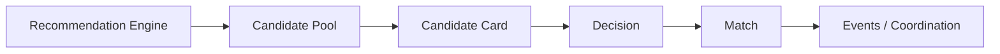
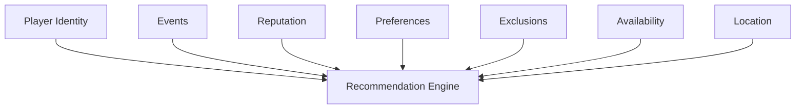

# Tech Plan: Player Discovery & Recommendation System

## Status

Approved

## Owner

TODO

## Product Domain

SWIPE / DISCOVERY

## Planning Level

Level 2: Domain

References:

- Level 1 foundation documents: `ARCH-001`, `DESIGN-001`, `PROFILE-001`
- Related Level 2 domain plans: `EVENT-001`

## Purpose

This document is the canonical technical plan for player discovery and recommendations within Scout. The swipe deck is one interface for discovery, but the domain is broader: helping compatible players find each other and move toward real-world play.

Every future Swipe, Feed, Events, Recommendations, Search, Profile, Chat, Notifications, and future ML feature should treat this plan as the conceptual authority for discovery, candidate eligibility, ranking, decisions, matches, exclusions, and recommendation learning.

## Problem Statement

Scout's discovery experience depends on recommending compatible players and opportunities in a way that creates meaningful real-world connections. A card deck can present candidates, but the underlying system must define who is eligible, how candidates are ranked, how decisions are recorded, how matches are created, and how learning improves future recommendations.

Without a shared Discovery & Recommendation domain, future features may duplicate ranking logic, bypass exclusions, expose private users, create inconsistent matches, or optimize for swipes instead of successful play.

## Discovery Philosophy

Scout should optimize for meaningful real-world connections rather than maximizing swipes or engagement.

Recommendations should prioritize:

- Compatibility.
- Likelihood of successful play.
- Long-term community health.
- Player reliability.
- Local relevance.
- Availability alignment.
- Mutual sport interests.
- Diversity and freshness.
- Respect for privacy, blocking, and visibility rules.

Scout should avoid optimizing purely for:

- Endless swiping.
- Short-term interaction volume.
- Superficial profile judgments.
- Engagement loops that do not lead to play.
- Recommending the same kind of candidate until discovery feels narrow or stale.

The ideal recommendation helps a player find someone they would actually enjoy playing with.

## Recommendation Philosophy

Recommendations should balance multiple signals rather than depend on a single score.

Conceptual signal categories:

- Sports compatibility.
- Skill compatibility.
- Availability overlap.
- Location and travel radius.
- Mutual interests.
- Prior decisions.
- Exclusions and safety rules.
- Player reliability.
- Recommendation diversity.
- Candidate freshness.
- Repeat-player satisfaction.
- Event or organizer context when relevant.

Recommendation logic should start simple and explainable. More advanced ranking, collaborative filtering, or ML models may come later, but the conceptual model should remain stable as implementation evolves.

## Success Metrics

Discovery success should be measured by real-world outcomes, not swipe volume.

Conceptual success metrics:

- Recommendation acceptance rate.
- Match rate.
- Successful games created.
- Recommendation diversity.
- Repeat-player satisfaction.
- Empty deck rate.
- Time to first meaningful connection.
- Match-to-conversation or coordination rate.
- Match-to-play conversion rate.
- Negative feedback or block rate after recommendation.

Swipe count alone is not a success metric. A smaller number of high-quality recommendations is healthier than a large number of low-quality interactions.

## Conceptual Model

Discovery & Recommendation is modular:

```text
Player Discovery & Recommendation
├── Candidate Pool
├── Recommendation Engine
├── Ranking
├── Candidate Card
├── Decision
├── Match
├── Feedback
├── Exclusions
├── Learning
└── Discovery Lifecycle
```

This plan defines the conceptual domains. It does not decide the final database schema or ranking implementation.

## Relationship Diagrams

### Discovery Flow



### Recommendation Inputs



## Domain Invariants

The following rules must always remain true:

- A candidate should not appear twice unless an approved rule allows it.
- Recommendations must always respect privacy and blocking rules.
- Match creation has a single authoritative source.
- Every decision is idempotent.
- Consumers receive recommendation contracts rather than direct recommendation engine state.
- Exclusions must be applied before presentation.
- Ranking logic must not be duplicated across features.
- Candidate eligibility must be evaluated before ranking.
- Feedback should influence future recommendations only through approved learning rules.
- Recommendation scoring is server-owned unless an approved ADR states otherwise.

If implementation work would violate one of these invariants, it requires a new approved technical plan before proceeding.

## Discovery Domains

### Candidate Pool

Candidate Pool represents the eligible set of players or opportunities that may be recommended.

Candidate eligibility should consider:

- Visibility.
- Blocking.
- Discoverability.
- Sport compatibility.
- Location constraints.
- Prior decisions.
- Safety exclusions.
- Account status.

### Recommendation Engine

Recommendation Engine represents the system that selects, scores, filters, and returns candidate recommendations.

Recommendation Engine ownership should remain centralized. Features should not implement their own ranking algorithms.

### Ranking

Ranking represents the ordered relevance of eligible candidates.

Ranking may consider compatibility, diversity, freshness, reliability, availability, location, mutual interests, and player experience.

### Candidate Card

Candidate Card represents the presentation contract for a discovery candidate.

It should provide enough context for a decision without exposing private profile data or encouraging superficial judgment.

### Decision

Decision represents a user's action on a recommendation.

Candidate actions may include:

- Interest.
- Pass.
- Undo, future.
- Save for later, future.
- Report or block, if approved.

Decisions must be idempotent and should not create duplicate state.

Decision lifecycle:

1. Candidate is presented through an approved recommendation contract.
2. User submits one approved decision action for the candidate in that context.
3. The authoritative decision owner validates current eligibility and lifecycle state.
4. The decision is recorded once.
5. The candidate is excluded from repeat presentation unless an approved rule allows re-entry.
6. Any match check or feedback update happens through centralized Discovery/Match rules.

Decision invariants:

- The same user/candidate/context decision must be safe to retry.
- Duplicate taps, network retries, or replayed requests must not create duplicate decision state.
- A later decision cannot silently contradict an earlier decision unless a future undo or override rule is approved.
- Client UI state is not the source of truth for whether a decision exists.
- Decisions must be evaluated before a candidate re-enters a queue.

### Match

Match represents mutual interest or another approved compatibility event.

Match creation should have one authoritative source. Match behavior should support coordination toward real play.

Match creation ownership:

- Match creation belongs to an authoritative Discovery/Match service or repository boundary defined by a future implementation plan.
- Presentation surfaces may request or display match outcomes, but they must not independently decide that a durable match exists.
- Chat, Events, Feed, Notifications, and Profile may consume match contracts after creation.
- Match creation must respect privacy, blocking, reporting, account status, and candidate eligibility at creation time.

Match invariants:

- Mutual interest or another approved compatibility event can create at most one active match for the same participants and context unless a future plan defines repeat-match semantics.
- Match creation must be transactional or otherwise protected against duplicate creation.
- A match cannot bypass exclusions or safety rules.
- Match confirmation UI must be derived from authoritative match state.
- Match state should support coordination toward real-world play rather than ending at swipe feedback.

### Feedback

Feedback represents explicit or implicit signals used to improve future recommendations.

Feedback may include:

- Decisions.
- Match outcomes.
- Blocks or reports.
- Play completion.
- Repeat participation.
- User-entered preference changes.

Feedback should be used carefully to avoid reinforcing narrow or unfair recommendation patterns.

### Exclusions

Exclusions represent rules that prevent a candidate from being shown.

Exclusions may include:

- Already-seen candidates.
- Prior decisions.
- Blocks.
- Reports.
- Hidden users.
- Hidden sports.
- Privacy restrictions.
- Inactive or unavailable users.
- Safety restrictions.

Exclusions override ranking.

Exclusion categories:

| Category | Meaning | Boundary |
| --- | --- | --- |
| Blocked | Viewer or candidate has blocked the other user. | Must always exclude before presentation. |
| Reported or safety-restricted | Trust and safety state prevents recommendation. | Must override ranking and UI convenience. |
| Hidden | User has hidden, muted, dismissed, or otherwise suppressed the candidate or related context. | Future semantics must define duration and scope. |
| Already decided | Candidate has an existing pass, interest, or other terminal decision for this context. | Must be checked before queue presentation. |
| Already matched | Candidate is already connected through an active match where repeat recommendation is not approved. | Match state must be authoritative. |
| Ineligible | Candidate fails required sport, visibility, account status, privacy, or minimum profile gates. | Eligibility is evaluated before ranking. |
| Exhausted | Candidate was previously shown enough times under approved presentation rules. | Re-entry requires explicit freshness or retry rules. |
| Unavailable | Candidate is temporarily unavailable for the current context, such as schedule or location constraints. | Missing data should not equal unavailable unless approved. |

Exclusion invariants:

- Exclusions must be centralized and applied before presentation.
- Ranking must never reintroduce excluded candidates.
- Clients may render empty/recovery states, but they must not create feature-local exclusion systems.
- Exclusion reasons exposed to users must be privacy-safe and should not reveal blocks, reports, safety state, or private preferences.
- Future learning can consume exclusion outcomes only through approved feedback rules.

### Learning

Learning represents how recommendations improve over time.

Learning may start with simple deterministic rules and later evolve into collaborative filtering or ML models. Learning behavior must remain explainable enough for debugging, safety, and user trust.

### Discovery Lifecycle

Discovery Lifecycle represents how a candidate moves from eligibility to recommendation outcome.

Lifecycle transitions should be centralized and observable.

## Discovery Lifecycle

Discovery lifecycle:

1. `Candidate`
2. `Presented`
3. `Decision Recorded`
4. `Matched` or `Excluded`
5. `Coordinated`
6. `Played`
7. `Feedback`
8. `Future Recommendation Learning`

### Candidate

A player or opportunity is eligible for recommendation after privacy, blocking, visibility, safety, and basic compatibility checks.

### Presented

The candidate is shown through an approved contract such as Candidate Card, Feed Recommendation, or future recommendation surface.

### Decision Recorded

The user action is recorded idempotently. The same decision should not create duplicate state.

### Matched or Excluded

Mutual interest or another approved matching rule may create a Match. Pass, block, report, incompatibility, or other exclusion rules may remove the candidate from future presentation.

### Coordinated

Matched players may coordinate through Chat, Events, Notifications, or another approved surface.

### Played

If coordination results in real-world play, that outcome may become a future learning or reputation signal.

### Feedback

Explicit or implicit feedback may be captured according to approved rules.

### Future Recommendation Learning

Approved learning rules may update future candidate eligibility, ranking, diversity, or freshness.

## Recommendation Contracts

Consumers should not receive the internal recommendation model. They should receive context-specific contracts.

### Candidate Card

Purpose: help a player decide whether another player seems compatible for play.

Likely concepts:

- Player Identity summary.
- Sports compatibility.
- Skill context.
- Availability context.
- Approximate location or distance, if approved.
- Shared context.
- Trust or reputation cues, if approved.
- Primary decision actions.

### Match Notification

Purpose: communicate mutual interest and guide the next step.

Likely concepts:

- Matched player summary.
- Match reason or context, if approved.
- Suggested next action.
- Privacy-safe notification copy.

### Discovery Queue

Purpose: provide an ordered set of recommendations for a discovery surface.

Likely concepts:

- Candidate ordering.
- Pagination or refresh state.
- Empty state reason.
- Presentation metadata.

### Recommendation Summary

Purpose: explain or preview why a recommendation may be relevant.

Likely concepts:

- Shared sport.
- Similar skill.
- Overlapping availability.
- Nearby play area.
- Mutual connection or event context, if approved.

### Future Feed Recommendations

Purpose: allow Feed to present recommendations without owning ranking logic.

Likely concepts:

- Recommended player, event, or group.
- Reason for recommendation.
- Primary action.
- Dismiss or feedback option.

## Ownership Matrix

Discovery owns recommendation logic and discovery state. Other systems consume recommendation contracts and should not take ownership of ranking, exclusions, or match creation.

| Concept | Owning System | Consumers | Boundary Rule |
| --- | --- | --- | --- |
| Recommendation scoring | Discovery / Recommendation Engine | Swipe, Feed, Events, Notifications, Search | Scoring must remain centralized and server-owned unless an approved ADR says otherwise. |
| Candidate eligibility | Discovery + Player Identity + Safety | Swipe, Feed, Search, Recommendations | Eligibility must respect privacy, blocking, account status, and visibility rules. |
| Swipe decisions | Discovery / Swipe | Matches, Recommendations, Feed | Decisions must be idempotent and use approved decision semantics. |
| Match creation | Discovery / Match service | Chat, Events, Notifications, Feed, Profile | Match creation has one authoritative source. |
| Exclusions | Discovery + Safety + Privacy | Swipe, Feed, Search, Recommendations | Exclusions override ranking and presentation. |
| Recommendation learning | Discovery / Recommendation Engine | Swipe, Feed, Events, Recommendations | Learning rules require approved plans and must not be duplicated in clients. |
| Recommendation presentation | Swipe, Feed, Search, Notifications | Users | Presentation consumes contracts; it does not own scoring or eligibility. |
| Player profile data | Player Identity | Discovery, Swipe, Feed, Events | Discovery consumes Player Identity contracts and must not duplicate profile ownership. |
| Event context | Events | Discovery, Feed, Notifications | Discovery may consume Event contracts for relevance but does not own event state. |

If a consuming feature needs recommendation data outside its approved contract, it must propose a contract change through an approved tech plan.

## Relationship Contracts

Discovery consumes Player Identity contracts for candidate display and eligibility. It does not own player profile data.

Discovery may consume:

- Player Identity summaries.
- Availability and preference contracts.
- Privacy and visibility rules.
- Event contracts for play context.
- Reputation contracts when approved.
- Safety and blocking signals.

Other domains consume Discovery contracts rather than direct recommendation engine state:

- Swipe consumes `Discovery Queue` and `Candidate Card`.
- Feed consumes `Future Feed Recommendations`.
- Notifications consume `Match Notification`.
- Events may consume recommendation summaries for organizer or player suggestions.
- Search may consume recommendation summaries when ranking search results.

This keeps ownership clear: Discovery owns recommendation logic; Profile owns player identity; Events owns real-world coordination; consumers receive contracts.

## Downstream Consumers

Discovery data is consumed across Scout. Any discovery change must consider downstream consumers.

Known and future consumers:

- Swipe deck.
- Feed recommendations.
- Match modal.
- Notifications.
- Chat entry points.
- Events and organizer suggestions.
- Search.
- Player Profiles.
- Recommendations service.
- Future Teams.
- Future web discovery surfaces.

Discovery changes should document:

- Which consumers are affected.
- Which recommendation contract is affected.
- Whether ranking or eligibility changes.
- Whether exclusions or privacy rules change.
- Whether match creation changes.
- Whether notification copy changes.
- Whether the change affects real-world coordination outcomes.

## Future Extensions

The Discovery & Recommendation domain should remain extensible for:

- Recommendation learning.
- Collaborative filtering.
- Organizer recommendations.
- Event recommendations.
- Teammate suggestions.
- Repeat-player weighting.
- Seasonal activity.
- Future ML models.
- Group recommendations.
- Venue recommendations.
- Coach or clinic recommendations.
- Recommendation explainability.

These should not be implemented now. They should influence extensibility by preventing narrow assumptions that would make future recommendation systems difficult.

New recommendation capabilities should extend the existing conceptual model rather than creating parallel recommendation systems. Every new feature should either consume an existing recommendation contract or propose a new contract through an approved tech plan.

## Goals / Non-goals

### Goals

- Define Discovery & Recommendation as the domain, with swipe as one interface.
- Define discovery philosophy and recommendation philosophy.
- Define conceptual recommendation domains.
- Define domain invariants.
- Define discovery lifecycle.
- Define recommendation contracts.
- Define ownership boundaries.
- Document downstream consumers.
- Reserve extensibility for future recommendation learning and ML.
- Prepare future Jira tickets after approval.

### Non-goals

- Build a machine learning recommendation system.
- Decide final ranking algorithms.
- Decide final database schema.
- Implement messaging.
- Implement events.
- Change database schema without approval.
- Redesign the full app navigation.
- Move existing swipe files.

## User Stories

- As a player, I want to discover compatible players so that I can find people to play with.
- As a player, I want recommendations to show skill, sport, availability, and relevant context so that I can make informed decisions.
- As a player, I want my decisions saved reliably so that I do not repeatedly see the same people.
- As a player, I want Scout to respect my privacy, blocks, and preferences while recommending people.
- As a player, I want to know when a match happens so that I can take the next step.
- As a product owner, I want recommendation logic to start simple and evolve based on real-world outcomes.
- As an AI implementation agent, I want ranking, exclusion, contract, and ownership rules so that recommendation behavior stays consistent.

## UX Flow

### Load Discovery Surface

1. User opens swipe, feed, search, or future discovery surface.
2. Surface requests an approved recommendation contract.
3. App shows loading state.
4. App displays recommendations or an empty state.
5. App handles load failure with recovery.

### Make Decision

1. User reviews candidate context.
2. User takes an approved action.
3. App records decision idempotently.
4. Recommendation state updates.
5. App advances to the next recommendation or next step.

### Match Feedback

1. User expresses interest.
2. App or service checks authoritative match creation rules.
3. Match is created if mutual interest or another approved rule applies.
4. App shows match confirmation.
5. User can dismiss or take the next approved coordination action.

### Learning Loop

1. Recommendation outcome is captured.
2. Approved feedback or outcome signals are processed.
3. Future recommendations improve according to approved learning rules.

## Architecture

Current relevant areas:

- `Scout/Swipe`
- `Scout/Swipe/Data`
- `Scout/Swipe/Models`
- `Scout/Swipe/ViewModels`
- `Scout/Swipe/Views`
- `Scout/Swipe/MatchModal`
- `Scout/Data/Profiles`
- `Scout/Domain/Profile.swift`

Expected conceptual pattern:

- Swipe and other presentation surfaces render recommendation contracts.
- View models manage presentation state, gestures, loading, empty, error, and match feedback.
- Recommendation services own candidate fetching, eligibility, ranking, exclusions, decisions, and match creation when implementation is approved.
- Player Identity supplies approved profile contracts.
- Events supplies approved coordination contracts when recommendations use event context.
- Match creation behavior is documented before implementation.

### Approved Direction

Recommendation rules, ranking ownership, decision semantics, exclusion rules, match creation, recommendation contracts, service boundaries, persistence schema, and learning behavior require approval before implementation.

Recommendation scoring should be treated as server-owned unless an approved ADR states otherwise.

## Database Changes

No database schema is approved by this plan.

Potential future schema areas requiring approval:

- Decision history.
- Matches.
- Candidate exclusion rules.
- Match status.
- Recommendation feedback.
- Recommendation queue state.
- Timestamps and audit fields.
- Block/report interactions if included.
- Learning or ranking features if persisted.

Schema work should be generated through later tickets after contracts, decisions, exclusions, and match creation are approved.

## API / Service Changes

No API or service changes are approved by this plan.

Potential future operations:

- Fetch discovery queue.
- Fetch candidate card summaries.
- Record pass.
- Record interest.
- Record feedback.
- Check or create match.
- Refresh recommendation queue.
- Apply exclusions.
- Fetch match notification summary.
- Fetch feed recommendation summary.

Service contracts should define idempotency, authorization, privacy filtering, exclusion behavior, and error behavior.

## UI Components

Likely UI components:

- Candidate card.
- Card detail sections.
- Decision buttons.
- Gesture overlays.
- Match modal.
- Discovery queue loading state.
- Discovery empty state.
- Discovery error and retry state.
- Recommendation reason display.
- Feedback or dismiss controls.

This plan does not approve implementation of these components.

## AI Rules

Future AI agents must:

- Centralize recommendation logic.
- Never duplicate ranking algorithms across features.
- Never bypass exclusion rules.
- Always treat recommendation scoring as a server-owned concern unless an approved ADR states otherwise.
- Never create new decision semantics without an approved tech plan.
- Never create match creation logic outside the authoritative match source.
- Use recommendation contracts instead of giving features direct recommendation engine state.
- Reuse existing Candidate Card, Discovery Queue, Match Notification, and Recommendation Summary contracts where possible.
- Document affected downstream consumers for every discovery change.
- Document eligibility, ranking, exclusion, privacy, and match creation impacts for every discovery change.
- Treat recommendation learning as a product and architecture decision, not incidental UI behavior.

## Dependencies

- Player Identity contracts for candidate display and eligibility.
- Event contracts for coordination outcomes and future event recommendations.
- Design system card and feedback patterns.
- Database decisions for decisions, exclusions, and matches.
- API boundary decisions for recommendation scoring and match creation.
- Trust and safety requirements.
- Future reputation contracts.

## Milestones

1. Approve Discovery & Recommendation conceptual model.
2. Approve domain invariants and ownership matrix.
3. Approve discovery lifecycle.
4. Approve recommendation contracts.
5. Approve v1 recommendation inputs.
6. Approve decision semantics and match creation rules.
7. Plan schema and service changes in later tickets.
8. Define candidate card and discovery queue UI flows after design approval.
9. Add tests and validation.

## Risks

- Simple recommendation rules may produce low-quality recommendations.
- Missing exclusion rules may show repeated or inappropriate candidates.
- Non-idempotent decision writes may create duplicate state.
- Match creation may need server-side authority.
- Empty states may be common in early markets.
- Ranking logic may fragment if features implement their own recommendations.
- Recommendations may optimize for engagement instead of real-world play.
- Learning systems may reinforce narrow or unfair recommendations if not designed carefully.
- Privacy or blocking rules may be bypassed if exclusions are not centralized.

## Testing Strategy

Conceptual planning validation:

- Confirm discovery philosophy is documented.
- Confirm recommendation domains are documented.
- Confirm domain invariants are documented.
- Confirm discovery lifecycle is documented.
- Confirm recommendation contracts are documented.
- Confirm ownership matrix is documented.
- Confirm downstream consumers are documented.
- Confirm no final schema or ranking algorithm is implied.

Future implementation should include:

- Unit tests for discovery queue state transitions.
- Unit tests for decision idempotency.
- Unit tests for exclusion rules.
- Unit tests for match creation rules.
- Contract tests for Candidate Card, Match Notification, Discovery Queue, Recommendation Summary, and Future Feed Recommendations if implemented.
- Repository or service tests for candidate loading and decision recording.
- Privacy and blocking tests.
- Empty deck and refresh tests.
- Manual QA for loading, empty, error, swipe, tap, match, and feedback states.
- `make build` and relevant `make test` validation.

## Rollout Plan

1. Use this plan as the canonical Discovery & Recommendation document.
2. Approve a narrow v1 recommendation model.
3. Plan schema, service boundaries, decisions, exclusions, match creation, and contracts separately.
4. Release through the existing swipe surface first if approved.
5. Monitor recommendation acceptance, match rate, empty deck rate, time to first meaningful connection, diversity, and real-world play outcomes.
6. Add Feed recommendations, event recommendations, learning, or ML through follow-up plans.

## Definition of Done

- Discovery philosophy approved.
- Recommendation philosophy approved.
- Conceptual model approved.
- Domain invariants approved.
- Discovery lifecycle approved.
- Recommendation contracts approved.
- Ownership matrix approved.
- Downstream consumers documented.
- Success metrics documented.
- Future extensions documented.
- Recommendation scoring ownership documented.
- Database and service changes approved in later plans where needed.
- Jira tickets created and sequenced only after relevant approvals.
- Tests and validation pass for implemented work.
- Documentation updated.

## Jira Breakdown Candidates

- `SWIPE: Approve Discovery & Recommendation conceptual model`
- `SWIPE: Document recommendation domain invariants`
- `SWIPE: Define discovery lifecycle`
- `SWIPE: Define recommendation ownership matrix`
- `SWIPE: Define Candidate Card contract`
- `SWIPE: Define Match Notification contract`
- `SWIPE: Define Discovery Queue contract`
- `SWIPE: Define Recommendation Summary contract`
- `SWIPE: Define Future Feed Recommendations contract`
- `SWIPE: Document v1 recommendation inputs`
- `SWIPE: Define decision semantics`
- `SWIPE: Define match creation authority`
- `SWIPE: Plan discovery schema changes`
- `SWIPE: Plan recommendation service boundaries`

These are planning tickets unless later approval authorizes implementation.

## Open Questions

- What exact inputs should v1 recommendations use?
- Should match creation happen client-side or through an Edge Function?
- What actions exist besides pass and interest?
- How should undo work, if at all?
- How should empty local markets be handled?
- Which recommendation contracts are required for v1?
- How should recommendation contract changes be versioned?
- What is the minimum viable exclusion model?
- What recommendation signals are allowed before explicit user consent?
- How should recommendation diversity be measured?
- How should repeat-player weighting work?
- What real-world play outcome signals can safely influence recommendations?
- What ADR is required before any client-owned scoring?
